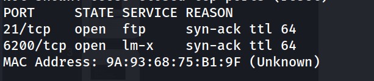
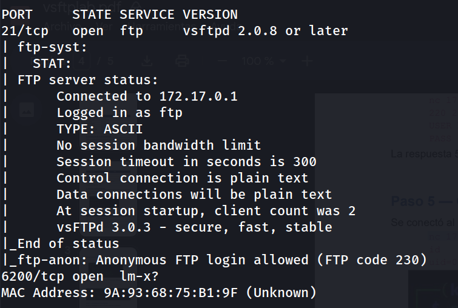
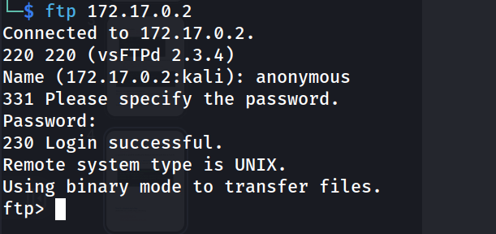
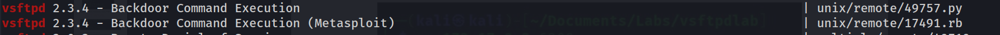
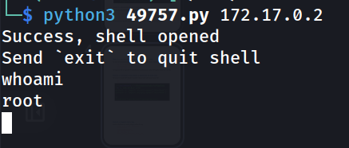
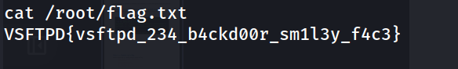
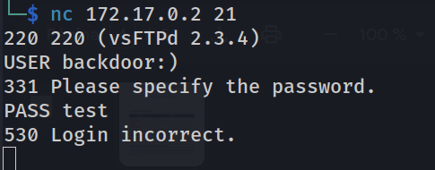
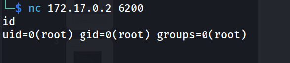

## Información General

|Campo|Valor|
|---|---|
|**Plataforma**|whoami-labs|
|**Máquina**|vsftpd|
|**Dificultad**|Fácil|
|**IP Objetivo**|172.17.0.2|
|**Autor**|elc0ket|

## Resumen del Ataque

La máquina expone un servicio FTP (puerto 21) que permite login anónimo, y un puerto adicional (6200) que a priori parece un servicio desconocido. El escaneo de versión revela una discrepancia interesante: el banner de conexión inicial muestra `vsFTPd 2.3.4`, mientras que el escaneo con `-sV` de Nmap detecta `vsftpd 2.0.8 or later`. Esta versión (2.3.4) es conocida por contener una backdoor intencionada introducida en el código fuente del proyecto entre junio y julio de 2011, que se activa al enviar una cadena con el patrón `:)` (smiley) como parte del usuario en el comando `USER`. Al activarse, la backdoor abre un shell de root en el puerto 6200/tcp. Usando un exploit público en Python se logra desencadenar la condición y obtener una shell como root, permitiendo leer la flag directamente.

## Técnicas Usadas

- Escaneo de puertos completo con Nmap (`-p-`)
- Escaneo de versión y scripts por defecto (`-sC -sV`)
- Enumeración de servicio FTP con login anónimo
- Identificación de versión vulnerable mediante banner grabbing
- Búsqueda de exploits públicos con `searchsploit`
- Explotación de backdoor vsFTPd 2.3.4 (CVE-2011-2523)
- Conexión manual a shell de backdoor con Netcat

## Desarrollo

### 1. Escaneo inicial de puertos

Se realiza un escaneo SYN completo sobre todos los puertos para identificar servicios expuestos:

```bash
nmap -p- -sS --min-rate 5000 -n -vvv -Pn -oN ports 172.17.0.2
```

Resultado:



Se identifican dos puertos abiertos: 21 (FTP) y 6200 (servicio no estándar).
### 2. Escaneo de versiones y scripts

```bash
nmap -p 21,6200 -sC -sV -oN allports 172.17.0.2
```

Resultado relevante:



Nmap reporta login FTP anónimo permitido y una versión de vsftpd 2.0.8+ (detección genérica basada en fingerprint).

### 3. Conexión manual al servicio FTP

```bash
ftp 172.17.0.2
```



El banner de bienvenida revela la versión real: **vsFTPd 2.3.4**, distinta a la detectada por el fingerprint de Nmap. Esta versión es de especial interés ya que contiene una backdoor conocida.

### 4. Búsqueda de exploits

```bash
searchsploit vsftpd
```

Se localiza el exploit correspondiente a la backdoor de vsFTPd 2.3.4:



### 5. Obtención del exploit

```bash
searchsploit -m 49757.py
```

### 6. Ejecución del exploit

```bash
python3 49757.py 172.17.0.2
```



El exploit envía un usuario con el patrón `:)` en el comando `USER` a través del puerto FTP, lo que activa la backdoor en el servicio y abre un listener de shell con privilegios de root en el puerto 6200/tcp, conectándose automáticamente a él.

### 7. Captura de la flag

```bash
cat /root/flag.txt
```



### 8. Verificación manual de la backdoor (comprobación adicional)

Para entender mejor el mecanismo, se intenta activar la backdoor manualmente vía Netcat:

```bash
nc 172.17.0.2 21
```



Aunque el login falla (comportamiento normal), la condición ya ha quedado activada en el servidor. Al conectarse directamente al puerto 6200 se confirma la shell de root abierta:

```bash
nc 172.17.0.2 6200
```



## Lecciones Aprendidas

- La detección de versión de Nmap (`-sV`) no siempre es fiable al 100%; el banner de conexión directo al servicio puede revelar información más precisa (en este caso, la diferencia entre "2.0.8 or later" y la versión real "2.3.4" fue clave para identificar la vulnerabilidad).
- Versiones de software comprometidas en su distribución oficial (supply chain) pueden contener backdoors intencionadas, no solo vulnerabilidades accidentales.
- El patrón `:)` en el campo de usuario de FTP es un IOC (indicador de compromiso) reconocible de esta backdoor específica.
- Es fundamental contrastar el resultado de herramientas automatizadas (Nmap) con la interacción manual directa al servicio para no pasar por alto detalles importantes.
- La explotación no requiere autenticación válida: basta con enviar el patrón correcto en el comando `USER`, incluso si el login posterior falla.

## Medidas de Mitigación

- Actualizar vsftpd a una versión oficial y verificada, evitando descargar binarios de fuentes no oficiales o repositorios comprometidos.
- Verificar la integridad de los paquetes descargados mediante checksums o firmas digitales antes de su instalación.
- Deshabilitar el acceso FTP anónimo si no es estrictamente necesario.
- Migrar a protocolos de transferencia de archivos cifrados (SFTP/FTPS) en lugar de FTP en texto plano.
- Implementar reglas de firewall que restrinjan el acceso a puertos no documentados o inesperados como el 6200/tcp.
- Monitorizar y auditar los servicios expuestos regularmente para detectar comportamientos anómalos o puertos no autorizados.